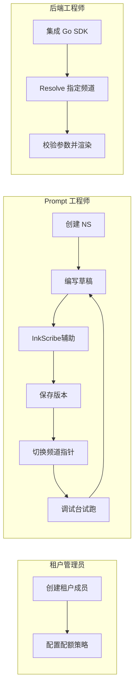
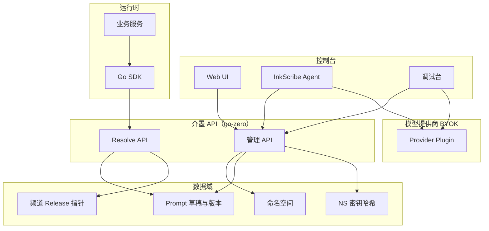

# 介墨（JieInkforge）Prompt 管理平台 — 产品需求文档（PRD）

## 文档控制信息

| 项目 | 内容 |
|------|------|
| 文档版本 | v1.3 |
| 文档状态 | Draft（立项评审用） |
| 产品中文名 | 介墨（寓意：执笔成篇，墨色可版本化、可追溯） |
| 英文代号 / Repo 建议 | JieInkforge（Jie-yuc → Jie；Ink + Forge → 工坊/锻造基建） |
| 作者 / 维护 | Jieyuc（品牌与开源 License 可归因） |
| 读者对象 | 产品、研发、安全合规、售前与交付 |
| 关联工件 | OpenAPI（规划中）；破坏性变更须单独 RFC；服务端实现选型见下文「技术栈与实现选型」 |
| 备选命名 | YucInk、JieInk；首推 **介墨 / JieInkforge** |

### 修订记录

| 版本 | 日期 | 变更摘要 |
|------|------|----------|
| v1.0 | — | 初稿：愿景、RBAC、登录/NS/密钥/Prompt/SDK/调试/InkScribe、NFR、里程碑 |
| v1.1 | 2026-05-18 | 重组为完整 PRD：文档头、背景与指标、范围边界、REQ-ID、验收标准、IA、架构示意；移除无效 YAML |
| v1.2 | 2026-05-18 | 记录服务端框架选型：**go-zero** |
| v1.3 | 2026-05-18 | 控制台登录专题拆至 [docs/prd-auth-console.md](prd-auth-console.md)，主文档第四节保留 REQ 摘要 |

---

## 背景与机会

团队在 AI 工程中重复面临：**Prompt 散落在代码库与文档中**、**版本与线上行为不一致**、**控制台撰写与运行时消费割裂**、**密钥与最小权限难以统一审计**。介墨定位为 **AI 项目基建**：集中管理 Prompt 正文、结构化参数、版本与发布频道，并通过 **命名空间 + 密钥** 提供程序化消费与安全边界；不与「单次会话型 Chat 产品」抢心智。

---

## 产品目标与成功指标（MVP 口径）

| 目标 | 指标 / 验收口径（示例） | 优先级 |
|------|-------------------------|--------|
| 运行时一致性 | 业务服务通过 Resolve API/SDK 获取指定频道下的 **已发布** Prompt；内容与 schema 与控制台一致 | P0 |
| 解析性能 | Prompt 解析 API **P95：200ms 以内**（无冷启动假设，见 NFR） | P0 |
| 密钥安全 | NS 密钥仅存哈希或 KMS 信封；创建时 **一次性明文**；轮转与禁用写审计 | P0 |
| 闭环迭代 | 控制台支持 **草稿 → 版本 → 频道指针 → 调试台试跑**；InkScribe（MVP+）衔接草稿改写 | P0 / MVP+ |
| 可观测 | 结构化日志带 `trace_id`；关键事件（登录失败阈值、密钥创建、频道切换）可检索 | P1 |

---

## 范围与非范围

### 按里程碑的价值交付

| 阶段 | 范围内 |
|------|--------|
| **MVP** | 登录；命名空间 CRUD/归档；NS 密钥；Prompt CRUD、参数 schema、版本快照、Diff、频道发布；租户 Resolve API；Go SDK（解析、渲染、校验）；调试台 BYOK，**2–3** 家国内模型插件 |
| **MVP+** | InkScribe：编辑页侧栏、草稿上下文、生成/改写、`usage_type=inkscribe` 配额与审计；**建议** P1 完成 tools 架构 |
| **v1.1** | SSO、发布审批、调试对比模式、Resolve **ETag**、InkScribe 指令模板与调试台一键联动 |
| **v2** | Skill 目录雏形、评测自动化、多云部署模板 |

### 明确不做（Non-goals）

- 不提供面向终端用户的通用聊天机器人（InkScribe **仅限** Prompt 工作台上下文）。
- MVP **不落库** MCP 注册表实现（仅预留导航与密钥 scope）。
- 不深做企业 DLP/内容合规引擎（编辑器内 **PII 风险提示占位**即可）。
- 平台统一模型 Key（平台代付）列为 **P2** SaaS 增值，不作为 MVP 必选。

---

## 假设与约束

- **模型与市场**：第一版以 **国内主流模型** 为主；法务与数据出境结论须在立项会闭环（见「决策记录」）。
- **BYOK**：调试台与 InkScribe **主推 BYOK**，密钥加密存储；便于租户自控成本与合规。
- **部署形态**：支持 SaaS 与私有化路线图；是否 **SaaS 优先 vs 私有化优先** 为待定决策。
- **占位符语法**：默认 `{{param_name}}`；是否与 Zeemo/Dify 等方言对齐 **待定**。
- **文档与 API**：PRD 与 OpenAPI **semver** 对齐；破坏性变更走 RFC。

---

## 技术栈与实现选型（服务端）

- **框架（已选）**：**[go-zero](https://github.com/zeromicro/go-zero)** 作为管理 API、Resolve API 及配套后端服务的实现基座（路由/handler、中间件、配置、限流、服务治理与可观测等与 NFR 对齐；具体 mono-repo 或拆分微服务由工程仓库决定，本 PRD 不强行规定粒度）。
- **契约**：HTTP 路径、鉴权与错误码等行为以 **PRD REQ-ID + OpenAPI（或 go-zero `.api` 定义再生成）** 为源；破坏性变更仍走 RFC。
- **边界**：客户端 **Go SDK** 保持对框架无感，仅依赖公开 HTTP 契约。

---

## 需求标识与优先级

- **REQ-ID** 形如 `AUTH-001`、`NS-001`，在全篇唯一。
- **P0**：MVP 必须；**P1**：紧邻版本 strongly recommended；**P2**：远期或增值。

### 需求总览表

| REQ-ID | 模块 | 简述 | 优先级 |
|--------|------|------|--------|
| AUTH-001～004 | 登录与会话 | 主路径登录、会话安全、账号类型 | P0～P1 |
| NS-001～005 | 命名空间 | CRUD/归档、隔离、配额、协作 | P0～P1 |
| KEY-001～004 | NS 密钥 | 创建/TTL/scope/轮转与审计 | P0 |
| PRM-001～010 | Prompt | 实体、正文、schema、版本、频道、扩展能力 | P0～P2 |
| SDK-001～004 | Go SDK / API | Resolve、渲染、校验、错误与兼容 | P0～P1 |
| DBG-001～004 | 调试台 | Provider、表单、记录、对比与成本 | P0～P1 |
| INS-001～008 | InkScribe | 场景、面板、上下文、输出动作、调试联动、tools | MVP+（部分 P1） |
| EXT-001～003 | Skill/MCP 预留 | 导航、scope、协议占位 | P0（占位） |

---

## 用户旅程（摘要）

1. **租户管理员**：接入身份方式 → 分配角色 → 配置 NS 级配额与审计保留。
2. **Prompt 工程师**：新建 NS → 新建 `prompt_key` → 编辑草稿（可选 InkScribe）→ 固化版本 → 将 **production** 指针指向新版本 → 调试台验证 → 通知业务发布。
3. **后端工程师**：申请 NS 密钥（`prompt:read`）→ SDK `ResolvePrompt` → 本地 `ValidateParams` + `Render` → 上线观察日志与延迟。

---

## 信息架构（控制台）

### 顶层导航（左侧）

| 导航项 | 说明 |
|--------|------|
| Prompt | Prompt 列表与检索 |
| 介墨写手 InkScribe | **可选顶层项**；或与 Prompt 编辑页 **右侧面板**二选一或并存 |
| Skill（即将推出） | 占位 |
| MCP（即将推出） | 占位 |
| 设置 | 租户/个人、会话与安全策略 |

### Prompt 详情（建议 Tab）

| Tab | 内容 |
|-----|------|
| 编辑 | 正文 + 参数 schema + 占位符校验 |
| 版本 | 快照列表、Diff、变更说明 |
| 发布 | 频道指针、回滚 |
| 调试 | 试跑、提供商与模型选择 |
| 审计 | 与本 Prompt 相关的指针与密钥事件摘要 |

---

## 系统上下文示意

---

## 一、概述与愿景

### 1.1 产品定位

介墨（JieInkforge）是企业/团队侧的 **Prompt 生命周期与治理**平台：统一管理 Prompt 正文、结构化参数定义、版本与发布渠道，并提供 **可被业务代码/SDK 程序化消费** 的访问方式与安全边界（命名空间 + 密钥）。当前版本聚焦 Prompt 管理；架构与数据模型预留 Skill、MCP 注册与治理的扩展入口，定位为 AI 项目基建，避免与单次对话产品耦合。

### 1.2 目标用户与价值

| 角色 | 价值 |
|------|------|
| 平台管理员 | 租户、配额、合规与审计 |
| Prompt / AI 工程师 | 编写、迭代、评测、上线；借助 InkScribe 快速产出与改写草案 |
| 后端工程师 | 通过 Go SDK 在运行时解析最新已发布 Prompt 与参数校验规则 |
| 安全/运维 | 密钥轮换、最小权限、泄露追溯 |

### 1.3 高层能力范围（第一版）

**MVP** 交付一条完整链路：**人机账号登录控制台** → 在租户下创建 **命名空间** 并签发 **NS 密钥** → 维护 **Prompt 草稿、参数 schema、不可变版本与频道指针** → 业务侧通过 **Resolve API + Go SDK** 按频道获取内容与 schema 并完成渲染前校验 → **调试台**（BYOK，2–3 家国内模型）试跑闭环。**MVP+** 引入 **InkScribe**（受控上下文、配额独立计量）。导航与密钥 **scope** 为 **Skill/MCP** 预留扩展位；MCP 注册表协议仅在 PRD 层占位，首版不落库实现。

---

## 二、术语表

| 术语 | 说明 |
|------|------|
| 租户 Tenant | 多租户顶层隔离边界（可用「组织」同义） |
| 命名空间 Namespace | 租户下逻辑隔离单元，承载 Prompt、密钥策略、配额 |
| Prompt Key | 命名空间内唯一的逻辑标识（人类可读 slug），SDK/API 用它拉取模板 |
| 版本 Version | Prompt 内容与参数 schema 的版本化快照 |
| Release / 频道 | 如 production / staging；Resolve 可按频道解析指针 |
| 参数 Schema | 变量列表：名称、类型、描述、必填、默认值、校验规则 |
| 介墨写手 / InkScribe | 控制台内专用于撰写与打磨提示词的 Agent；服务当前 Prompt 草稿与 NS 上下文 |

---

## 三、角色与权限（RBAC）

### 3.1 预置角色（可配置）

| 角色 | 能力摘要 |
|------|----------|
| 超级管理员 | 跨租户管理（私有化部署可选用） |
| 租户管理员 | 成员与角色、计费/配额上限、全局策略 |
| 命名空间所有者 | NS 配置、密钥全生命周期、Prompt 全流程 |
| 命名空间开发者 | Prompt 草稿/调试/提交版本；无密钥删除等高敏操作 |
| 命名空间只读 | 查看与导出审计 |
| 仅 API（服务账号绑定 NS Key） | 无控制台，仅程序化访问 |

### 3.2 权限模型要点

| 要点 | 说明 |
|------|------|
| 资源粒度 | 租户 → 命名空间 → Prompt → 版本 |
| 密钥绑定 | 密钥仅能绑定命名空间或服务账号；敏感操作写 **审计日志** |

### 3.3 权限矩阵（摘要）

| 能力 | 租户管理员 | NS 所有者 | NS 开发者 | NS 只读 | API 密钥 |
|------|------------|-----------|-----------|---------|----------|
| 管理租户成员 | ✓ | — | — | — | — |
| NS 归档/恢复 | ✓ | ✓ | — | — | — |
| 创建/轮转/禁用 NS 密钥 | ✓ | ✓ | — | — | — |
| Prompt 草稿编辑 | ✓ | ✓ | ✓ | — | — |
| 版本创建与 Diff | ✓ | ✓ | ✓ | ✓ | — |
| 切换频道指针 | ✓ | ✓ | ✓* | — | — |
| 调试台 / InkScribe | ✓ | ✓ | ✓* | — | — |
| Resolve API | — | — | — | — | ✓（scope 约束） |

\*具体是否允许开发者切 production 可由 NS 策略约束（审批流见 PRM-007）。

---

## 四、用户登录（AUTH）

细则（用户旅程、会话模型、限流与审计、REST 占位、go-zero 衔接）见专题文档：[docs/prd-auth-console.md](prd-auth-console.md)。本节保留 REQ 摘要以便总览。

| REQ-ID | 需求描述 | 优先级 |
|--------|----------|--------|
| AUTH-001 | 控制台主路径：**邮箱+密码** 或 **手机号+OTP**（二选一为主路径；立项定合规策略） | P0 |
| AUTH-002 | 会话：JWT 或服务端 Session；推荐 **HttpOnly Cookie + Refresh 轮转** | P0 |
| AUTH-003 | 登录限流；可选图形/行为验证码；租户级密码策略；设备与会话列表与强制下线 | P0 |
| AUTH-004 | 企业 SSO（SAML 2.0 / OIDC）；管理员强制 MFA（TOTP/WebAuthn） | P1 |

**账号类型**：控制台为 **人机账号**；Go SDK 使用 **NS 密钥** 或服务账号令牌（MVP 推荐 NS 密钥以保持简单）。

### 验收标准（AUTH）

| REQ-ID | 验收标准 |
|--------|----------|
| AUTH-001 | Given 合法凭证 When 登录 Then 建立会话并可访问授权 NS |
| AUTH-002 | Refresh 轮转成功后旧 Refresh 不可用；Cookie 属性符合安全基线 |
| AUTH-003 | 连续失败后触发限流或验证码；租户可强制密码复杂度 |
| AUTH-004 | SSO/MFA 关闭时不阻断 MVP；开启后策略可对管理员强制执行 |

---

## 五、命名空间（NS）

| REQ-ID | 需求描述 | 优先级 |
|--------|----------|--------|
| NS-001 | 租户下 **创建 / 归档 / 恢复** NS；归档后禁止新发布；读可按策略只读 | P0 |
| NS-002 | `ns_slug` **租户内唯一**；展示名可重复；元数据含描述、标签、所有者、默认频道 | P0 |
| NS-003 | **硬性隔离**：Prompt、版本、调试记录、密钥按 NS 隔离查询 | P0 |
| NS-004 | 配额：Prompt 数量、版本保留、月 API、并发调试、InkScribe token/请求、审计保留天数等可配置 | P0～P1 |
| NS-005 | NS 级成员列表与继承租户默认角色模板 | P1 |

**环境建模**：推荐 **多 NS + 密钥隔离**；亦可仅用元数据标注 dev/staging/prod（可选）。

### 验收标准（NS）

| REQ-ID | 验收标准 |
|--------|----------|
| NS-001 | 归档后无法新建版本或切换频道指针；恢复后流程恢复 |
| NS-002 | 重复 `ns_slug` 创建被拒绝并提示 |
| NS-003 | 自动化测试断言跨 NS 数据不可见 |
| NS-004 | 配额耗尽时对应操作返回明确错误码 |

---

## 六、命名空间密钥（KEY）

| REQ-ID | 需求描述 | 优先级 |
|--------|----------|--------|
| KEY-001 | 创建密钥：高熵生成（前缀如 `jf_live_` / `jf_dev_`），**明文仅一次性展示** | P0 |
| KEY-002 | 可选 TTL；到期拒绝鉴权；Scope：`prompt:read`（必选），预留 `skill:read` | P0 |
| KEY-003 | 禁用/轮转；可选宽限期；全程审计 | P0 |
| KEY-004 | 使用统计：最后使用时间、粗略调用计数（节流参考） | P0 |

**安全基线**：TLS；存储 **哈希（如 HMAC-SHA256）或 KMS 信封加密**（部署选型）；泄露响应：**禁用 + 通知 NS 所有者**。

### 验收标准（KEY）

| REQ-ID | 验收标准 |
|--------|----------|
| KEY-001 | 关闭对话框后无法再次查看明文；仅存储哈希或密文 |
| KEY-002 | Scope 不包含 `prompt:read` 的密钥无法调用 Resolve |
| KEY-003 | 轮转后旧密钥在策略窗口外返回 401 |
| KEY-004 | 管理界面可见最后使用时间 |

---

## 七、Prompt 管理（PRM）

### 7.1 实体模型（摘要）

| 字段/概念 | 说明 |
|-----------|------|
| prompt_key | 与 NS 组合唯一 |
| 草稿 | 未形成不可变版本前可编辑 |
| 版本链表 | semver 或单调整数 + 可选 tag |
| 发布指针 | 如 `latest@production` |

### 7.2 功能需求表

| REQ-ID | 需求描述 | 优先级 |
|--------|----------|--------|
| PRM-001 | Markdown/富文本正文；占位符 `{{param_name}}` 与 schema 对齐 | P0 |
| PRM-002 | 标签与检索：全文、tag、负责人、时间过滤 | P0 |
| PRM-003 | 变量表：类型、描述、必填、默认值、校验（regex/range/enum） | P0 |
| PRM-004 | 保存时校验占位符与 schema；未声明或未使用变量可配置为错误/警告 | P0 |
| PRM-005 | 版本快照捆绑内容与 schema；变更说明、创建人、时间；Diff | P0 |
| PRM-006 | 频道 production/staging/dev（可自定义）；回滚为指针指向旧版本 | P0 |
| PRM-007 | 审批流：可选 MR 式审批后方可切 production | P1 |
| PRM-008 | 导出 JSON/ZIP；导入灾备/克隆 | P1 |
| PRM-009 | PII 风险提示占位 | P1 |
| PRM-010 | 扩展：审计详情、breaking 标记、契约冻结、locale、评测备注（见下） | P0～P2 |

**扩展（PRM-010 明细）**

1. **审计**：指针变更、密钥创建可查。
2. **Breaking change**：schema 不兼容时 UI/SDK 告警。
3. **契约冻结**：已发布版本仅可增加可选参数（策略可配）。
4. **多语言**：同 key 下 locale 维度（zh-CN/en-US）。
5. **评测（P2）**：golden 样例手工备注。

**多模板片段（P1）**：系统/用户/工具分栏；MVP 可先单框 + 「角色」元数据。

### 验收标准（PRM）

| REQ-ID | 验收标准 |
|--------|----------|
| PRM-003～004 | Given schema 与正文不一致 When 保存 Then 阻断或警告（按配置） |
| PRM-005 | 版本创建后内容与 schema **不可变** |
| PRM-006 | Resolve(`channel`) 返回指针所指版本；回滚不改变历史快照 existence |

---

## 八、外部访问：Go SDK / Resolve API（SDK）

### 8.1 设计目标

类型友好；最小依赖（Go ≥ 1.21）；`context` 超时与可配置重试；**仅用 NS 密钥**，不暴露控制台密码。

### 8.2 能力与契约方向

| REQ-ID | 需求描述 | 优先级 |
|--------|----------|--------|
| SDK-001 | `ResolvePrompt(ctx, {NS, Key, PromptKey, Channel})` → Content, ParamsSchema, ResolvedVersion | P0 |
| SDK-002 | `Render(template, values)` 与平台占位符规则一致 | P0 |
| SDK-003 | `ValidateParams(schema, values)` 与平台规则对齐 | P0 |
| SDK-004 | LRU 缓存 + **ETag / If-None-Match**；OpenTelemetry hooks | P1 |

**HTTP 示例**：`GET /v1/ns/{slug}/prompts/{key}?channel=`；鉴权：`Authorization: Bearer {ns_key}` 或等价签名头。

### 8.3 错误与兼容

| 类别 | 行为 |
|------|------|
| 401 / 403 | 密钥无效、scope 不足、NS 归档拒绝写类操作 |
| 404 | key 或频道无指针 |
| 429 | 租户/NS 配额或全局限流 |
| 兼容性 | API semver；SDK minor 兼容承诺；破坏性变更使用 **v2 前缀或 deprecation header** |

### 验收标准（SDK）

| REQ-ID | 验收标准 |
|--------|----------|
| SDK-001 | 集成测试覆盖合法 Resolve 与错误分支 |
| SDK-003 | 与服务端校验一致性样本对齐 |
| SDK-004 | 304 路径减少载荷（v1.1 可与里程碑对齐） |

---

## 九、Prompt 调试功能（DBG）

**用户故事**：用户在控制台选择草稿或某版本，填写参数试跑，查看模型输出与 token/耗时。

### 9.1 Provider 范围（第一版建议）

统一抽象：**Provider、Model、ChatComplete**。选型 **3～4** 家，例如：

- 阿里云 DashScope（通义千问）
- 百度千帆（文心）
- 智谱 GLM
- Minimax 或 Moonshot Kimi（商务与合规择定）

**BYOK**：租户或 NS 级配置提供商 API Key（加密存储），平台代发；平台统一 Key 为 **P2**。

### 9.2 功能需求

| REQ-ID | 需求描述 | 优先级 |
|--------|----------|--------|
| DBG-001 | 按 schema 自动生成表单；支持 JSON Raw | P0 |
| DBG-002 | 选择提供商与模型；temperature/max_tokens 等模板 | P0 |
| DBG-003 | 展示渲染后完整 messages（可折叠）；单次试跑记录按 NS 保留策略 | P0 |
| DBG-004 | 对比模式；公开价粗糙成本估算（免责声明） | P1 |

### 验收标准（DBG）

| REQ-ID | 验收标准 |
|--------|----------|
| DBG-001 | 必填项缺失时阻止提交 |
| DBG-003 | 记录不含明文密钥；敏感字段哈希或摘要 |

---

## 十、介墨写手 InkScribe（INS）

### 10.1 定位与原则

与品牌 **JieInkforge** 并列；**唯一职责**：在当前 NS + 当前 Prompt（草稿或指定版本）上下文中，协助撰写、改写、结构化参数与设计说明；**禁止**通用闲聊（系统提示与路由硬约束）。闭环：**写好 → 试跑 → 再改**。

### 10.2 用户场景与需求

| REQ-ID | 需求描述 | 优先级 |
|--------|----------|--------|
| INS-001 | 从零生成：业务目标 → 初版正文 + 建议 `{{参数}}` → 一键写入草稿或插入 | MVP+ |
| INS-002 | 定向改写：Diff 视图接受后落库 | MVP+ |
| INS-003 | 参数表辅助：建议 schema，标 breaking | MVP+ |
| INS-004 | 评审清单：风险/歧义/注入面启发式（非法律承诺） | P1 |
| INS-005 | 入口：编辑页右侧面板；多轮会话默认绑定当前 `prompt_key` 草稿 | MVP+ |
| INS-006 | 上下文受控：草稿正文、schema、key、频道元数据；可选同 NS 其他 Prompt **仅标题** | MVP+ |
| INS-007 | 输出动作：插入光标；「覆盖草稿」二次确认 + 可选快照 | MVP+ |
| INS-008 | P1：指令模板；「用建议配置去调试」预填调试台 | P1 |

### 10.3 技术要点

| 要点 | 说明 |
|------|------|
| 模型调用 | 与第九章一致：Provider + BYOK；**usage_type=inkscribe** 独立计量 |
| 实现路线 | **MVP+** 可无 tools（生成 + 人工粘贴）；**P1** 建议 tools：`get_prompt_draft`、`propose_schema`、`apply_patch`（服务端可信执行） |
| 系统提示 | 平台固化，终端用户不可覆盖 |

### 10.4 权限与安全

RBAC：**命名空间开发者**及以上；NS 策略可关闭 InkScribe。会话与请求元数据按 NS 保留；支持清空会话。日志过滤疑似 API Key；粘贴秘密时 UI 警告（与调试台同源）。

### 10.5 与 Skill/MCP

InkScribe tools **插件注册表预留**：未来只读挂载 Skill 片段、MCP 工具说明查询；**不把 MCP 编排纳入第一版**。

### 验收标准（INS）

| REQ-ID | 验收标准 |
|--------|----------|
| INS-005 | Given Prompt 编辑页 When 打开 InkScribe Then 会话绑定当前 `prompt_key` 草稿上下文 |
| INS-006 | 会话上下文不默认携带其他租户数据；可选 Prompt 列表仅为标题 |
| INS-007 | 「覆盖草稿」未确认不改变服务端草稿 |
| INS tools（P1） | apply_patch 仅服务端校验并审计 |

---

## 十一、为未来扩展预留（Skill、MCP）（EXT）

| REQ-ID | 需求描述 |
|--------|----------|
| EXT-001 | 控制台导航预留：**Prompt \| InkScribe \| Skill \| MCP** |
| EXT-002 | NS 密钥 scope 预留：**skill:read**、**mcp:invoke** |
| EXT-003 | 版本化 + 频道发布模式复用到 Skill/MCP manifest；MCP 注册表 URL/工具清单 Schema/健康检查 **仅占位** |

---

## 十二、非功能需求（NFR）

| 维度 | 目标方向 |
|------|----------|
| 可用性 | 控制台与管理 API **99.5%+**（随部署 SLA 调整）；读路径可多副本 |
| 性能 | Prompt 解析 **P95：200ms 以内**；版本列表分页 |
| 安全 | OWASP Top 10 基线；密钥哈希；租户隔离 **单测套件** |
| 可观测 | 结构化日志 + trace_id；审计 **不可篡改**（WORM 或外部 SIEM） |
| 隐私 | 调试内容保留策略；GDPR/个保法删除请求流程（占位） |

---

## 十三、里程碑建议

| 阶段 | 范围 |
|------|------|
| MVP | 登录、NS、密钥、Prompt CRUD + 版本 + 频道、租户 API、Go SDK 读/渲染/校验、调试台 BYOK **2–3** 家模型 |
| MVP+ | InkScribe（面板、草稿上下文、改写/生成、usage_type 与审计）；tools 架构建议 P1 |
| v1.1 | SSO、审批、对比调试、ETag、InkScribe 指令模板与调试台联动 |
| v2 | Skill 目录雏形、评测自动化、多云部署模板 |

---

## 十四、决策记录（立项会闭环）

以下项须在立项会确认并回填「决议」。

| ID | 议题 | 选项摘要 | 推荐倾向（非最终） | 决议 | 决策人 | 截止日期 |
|----|------|----------|-------------------|------|--------|----------|
| D-001 | 部署优先级 | 纯多租户 SaaS vs 单机私有化优先 | 依据首发客户群选择 | | |
| D-002 | 占位符方言 | 自建 `{{}}` vs 对齐 Zeemo/Dify | 对齐可降低迁移成本 | | |
| D-003 | 商用模型与法务 | 国内清单 + 数据出境结论 | BYOK + 选型合规评审 | | |
| D-004 | InkScribe vs 调试模型 | 同一提供商 vs 分列「推理/成本」模型及配额分摊 | 分列更灵活；配额分项计量 | | |

---

## 十五、致谢与品牌

- 本项目 PRD 作者归因：**Jieyuc**。
- 开源/对客物料建议统一：**介墨 · JieInkforge**，`github.com/{org}/jieinkforge`，文档站点 `jieinkforge.io`（示例）。
