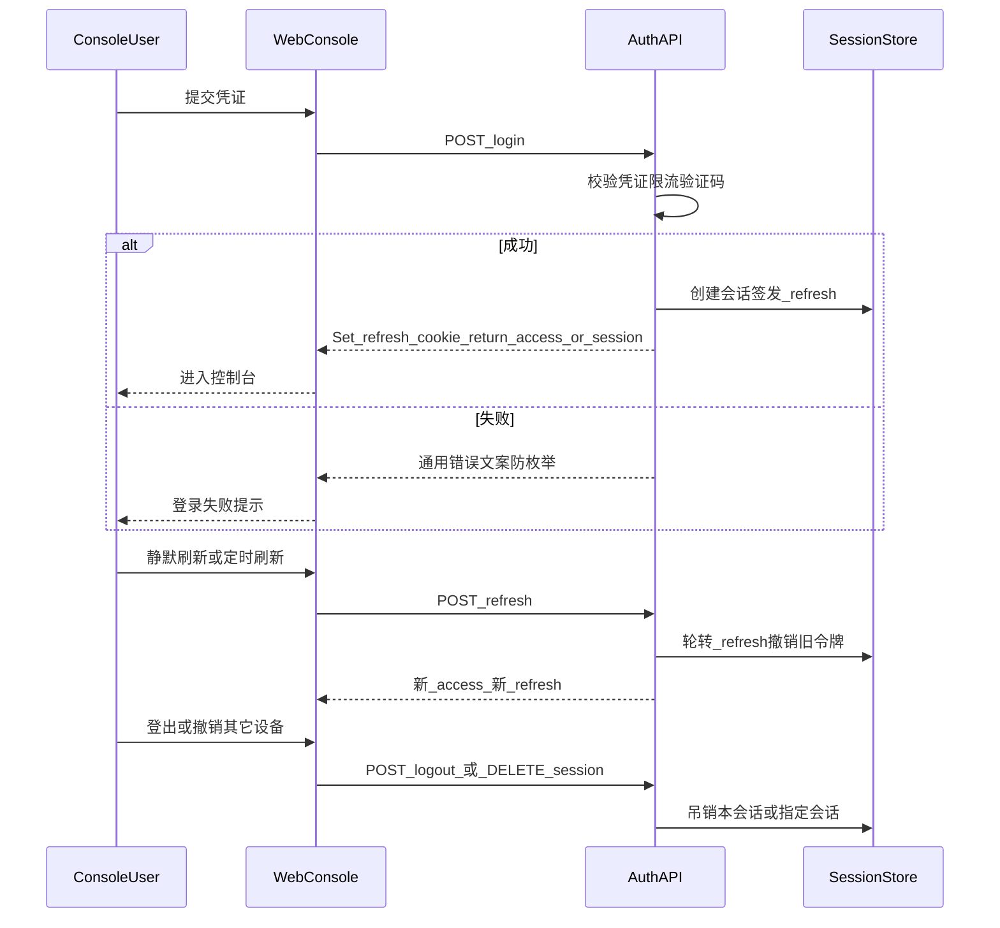

# 介墨（JieInkforge）控制台登录与认证 — 专题 PRD

## 文档控制信息

| 项目 | 内容 |
|------|------|
| 文档版本 | v0.1 |
| 文档状态 | Draft（主 PRD 拆章） |
| 关联主 PRD | [docs/inkforge.md](inkforge.md) |
| REQ-ID | 与主 PRD **AUTH-001～004** 对齐；本文细化实现与安全口径 |

### 与本专题对应的 REQ 映射

| REQ-ID | 摘要（与主 PRD 一致） | 优先级 |
|--------|----------------------|--------|
| AUTH-001 | 控制台主路径：邮箱+密码 **或** 手机号+OTP（二选一） | P0 |
| AUTH-002 | 会话模型：推荐 Access + Refresh（HttpOnly Cookie 轮转） | P0 |
| AUTH-003 | 限流、验证码、密码策略、会话与设备管理 | P0 |
| AUTH-004 | SSO（SAML/OIDC）、强制 MFA | P1 |

---

## 1. 范围与边界

| 范围内 | 范围外 |
|--------|--------|
| **控制台人机账号**的注册/邀请（待定）、登录、会话刷新与登出、密码与会话安全策略（按 MVP 裁剪） | **命名空间密钥（NS Key）**、**Resolve API**、Go SDK 调用链路的鉴权（见主 PRD KEY/SDK） |
| 租户成员身份建立后与 RBAC 的衔接（登录成功后签发的主体绑定租户与角色） | 第三方模型提供商 BYOK 密钥（见 DBG） |

---

## 2. 假设与决策占位（立项回填）

以下事项主 PRD 未强行拍板，实施前须在立项会确认并回填「决议」。

| ID | 议题 | 可选方案 | 决议 |
|----|------|----------|------|
| A-DEC-01 | MVP 主登录路径 | 邮箱+密码 **或** 手机号+OTP（二选一为主路径） | |
| A-DEC-02 | 成员入网方式 | 公开自助注册 / **租户邀请制（管理员创建成员）** / 混合 | |
| A-DEC-03 | 邮箱是否必选验证 | 注册后即可登录 / 验证邮箱后方可登录（推荐生产） | |
| A-DEC-04 | OTP 通道 | SMS / 邮件 OTP / 第三方验证码服务（服务商选型） | |
| A-DEC-05 | 合规 | 实名制、日志留存、跨境传输等与法务结论对齐（不占位结论） | |

---

## 3. 用户旅程（示意）

**补充流程（占位）**

- **忘记密码**：若 MVP 包含，则邮箱/手机验证链路 + 重置令牌一次性有效；若不包含，仅管理员重置或邀请重发。
- **会话列表 / 强制下线**：见 AUTH-003。

---

## 4. 功能细化

### 4.1 AUTH-001 — 主路径认证（P0）

| 主题 | 说明 |
|------|------|
| 入网 | **待定**：邀请制下由租户管理员创建成员并触发激活邮件/短信；自助注册若有则需防滥用（验证码、租户审批队列可作为 P1）。 |
| 邮箱+密码 | 登录表单校验（格式、长度）；密码传输仅 HTTPS；账户锁定策略：**连续失败 N 次锁定 M 分钟**（N/M 配置项，默认值立项定）。 |
| 手机+OTP | OTP **有效期**、**重发间隔**、**单日上限**（具体数值配置项）；风控：同 IP / 同号码组合限流。 |
| 防枚举 | 失败响应文案统一（如不区分「用户不存在」与「密码错误」）；日志侧可区分供风控，不对终端细分。 |

### 4.2 AUTH-002 — 会话模型（P0）

**推荐形态**：**短期 Access**（JWT 或不透明令牌）+ **长期 Refresh**，Refresh 仅存 **HttpOnly + Secure + SameSite** Cookie（首选 `Lax`/`Strict`，跨站场景单独评审）。

| 步骤 | 行为 |
|------|------|
| 登录成功 | 签发 Access（短 TTL，如 15～60 min，可配置）；签发 Refresh（长 TTL，如 7～30 d）；Refresh **服务端可撤销**（存储 ID 或哈希，关联用户与设备指纹占位）。 |
| 刷新 | 客户端用 Refresh 换取 **新 Access + 新 Refresh（轮转）**；旧 Refresh **一次性**，用后作废。 |
| 备选 JWT Stateless | Access 为 JWT、Refresh 仍服务端存储：利弊——运维简单 vs 吊销粒度依赖 TTL/blocklist；若采用须在安全评审中写明吊销策略。 |

**Cookie 属性清单（基线）**：`HttpOnly`、`Secure`（生产）、`SameSite`、`Path` 收窄、`Max-Age`/`Expires` 与 Refresh TTL 一致。

### 4.3 AUTH-003 — 安全加固与会话运营（P0）

| 主题 | 说明 |
|------|------|
| 限流维度 | **IP**、**账号标识**（邮箱/手机）、可选 **租户 ID**；429 与 Retry-After（若适用）。 |
| 验证码触发 | 连续失败次数阈值、可疑 ASN、租户策略开关；类型：图形 / 滑块 / 行为验证码（选型待定）。 |
| 租户级密码策略（邮箱路径） | 最小长度、复杂度（大小写/数字/符号）、密码历史（禁止最近 K 次）、过期天数（可选）。 |
| 会话与设备 | 会话列表：**创建时间、近似 UA/IP、当前会话标记**；支持 **撤销单会话**、**撤销全部其它会话**、**全局登出**。 |

**验收要点（补充）**

- 轮转成功后，窃取旧 Refresh 的重放请求被拒绝。
- 撤销会话后，对应 Access 在剩余 TTL 内行为：**尽力吊销**（blocklist / 版本戳）或接受短窗口风险并在文档披露。

### 4.4 AUTH-004 — SSO 与 MFA（P1）

| 主题 | 说明 |
|------|------|
| OIDC | Authorization Code + PKCE；控制台回调 URL 按环境配置；Claims 映射租户与角色（**JIT provisioning** 是否开通待定）。 |
| SAML 2.0 | SP-initiated；metadata 交换；时钟偏移容忍。 |
| MFA | TOTP（RFC 6238）与/或 WebAuthn；**租户策略**：可对「租户管理员」及以上强制；备份恢复码（生成、单次消费）建议 P1。 |

关闭 SSO/MFA 时不得阻断 MVP；开启后策略生效路径须有集成测试。

---

## 5. 安全与合规要点

| 主题 | 原则 |
|------|------|
| 口令存储 | 使用自适应哈希（如 Argon2id / bcrypt）；每人独立盐；工作量因子可配置；禁止明文或可逆加密存放登录密码。 |
| 令牌存储 | Refresh **不落 localStorage**（防 XSS）；Access 若存内存短期可行；移动端若有原生壳另述。 |
| 日志 | 不落明文密码与完整 OTP；可对 Refresh ID 记录哈希。 |
| CSRF | Cookie 场景下 **刷新 / 登出** 等状态变更接口须有 CSRF 防护（同源 Cookie、`SameSite`、或双重提交令牌）。 |

---

## 6. 审计事件（建议枚举）

下列事件写入审计日志（字段至少含：时间、租户、主体 ID、动作、结果、来源 IP、关联会话 ID 哈希）。

| 事件 | 说明 |
|------|------|
| auth.login.success | 登录成功 |
| auth.login.failure | 登录失败（原因码内部枚举，不外泄用户枚举） |
| auth.logout | 主动登出 |
| auth.refresh | Refresh 轮转成功 |
| auth.refresh.reuse_detected | 检测到 Refresh 重用（可疑轮转攻击） |
| auth.session.revoke | 撤销会话（本人或管理员） |
| auth.password.reset.requested / completed | 若启用重置密码流程 |
| auth.mfa.enabled / verified | P1 |

---

## 7. 与 go-zero 的衔接（无代码）

| 维度 | 说明 |
|------|------|
| 工程结构 | `auth` 路由分组；登录/刷新/登出 handler 与业务 logic 分层（契合 go-zero 惯例）。 |
| 中间件 | 鉴权中间件校验 Access；可选租户上下文注入；限流 middleware 与 AUTH-003 对齐。 |
| 契约 | `.api` 定义或 OpenAPI 生成 handler；错误码与 HTTP 状态码与附录一致方向。 |

---

## 8. 附录 A — REST 路径占位

路径前缀可按网关调整为 `/api/v1`；以下为语义占位。

| 方法 | 路径 | 用途 |
|------|------|------|
| POST | `/auth/login` | 凭证登录 |
| POST | `/auth/refresh` | 轮转 Refresh |
| POST | `/auth/logout` | 当前会话登出 |
| GET | `/me/sessions` | 会话列表 |
| DELETE | `/me/sessions/{id}` | 撤销指定会话 |
| POST | `/me/sessions/revoke_others` | 撤销其它会话 |
| POST | `/auth/password/forgot` | 忘记密码（若启用） |
| POST | `/auth/password/reset` | 重置令牌提交（若启用） |

SSO/OIDC/SAML 回调路径：**待定** `/auth/sso/callback/{provider}`。

---

## 9. 附录 B — HTTP 状态与错误码占位

| HTTP | 场景 |
|------|------|
| 200 / 204 | 成功 |
| 400 | 参数非法 |
| 401 | 未认证或令牌失效 |
| 403 | 已认证无权限 |
| 429 | 限流 |

响应体建议使用稳定 **`code`**（机器可读）+ **`message`**（对用户安全）；例如：`INVALID_CREDENTIALS`、`RATE_LIMITED`、`SESSION_REVOKED`、`MFA_REQUIRED`。具体枚举与 OpenAPI 同步维护。

---

## 修订记录

| 版本 | 日期 | 摘要 |
|------|------|------|
| v0.1 | 2026-05-18 | 初稿：AUTH 细化、旅程、审计与 API 占位 |
