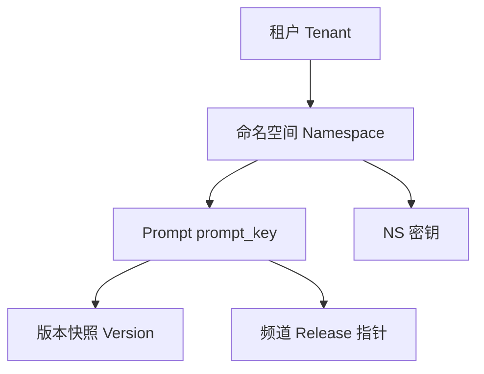
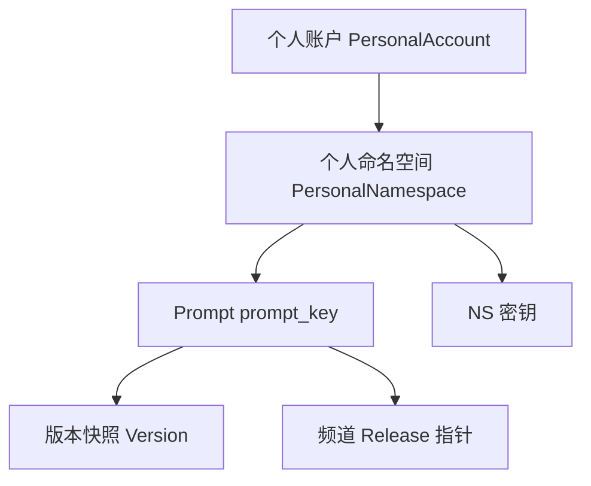
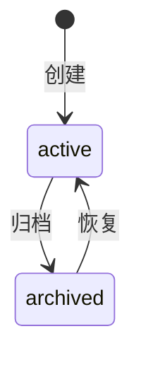

# 介墨（JieInkforge）命名空间（Namespace）— 专题 PRD

## 文档控制信息

| 项目      | 内容                                              |
| ------- | ----------------------------------------------- |
| Prompt 专题 | [docs/prd-prompt.md](prd-prompt.md)（内容与版本维护、Console 管理 API） |
| 文档版本    | v0.3                                            |
| 文档状态    | Draft（主 PRD 拆章）                                 |
| 关联主 PRD | [docs/inkforge.md](inkforge.md)                 |
| 读者对象    | 产品、后端/控制台研发、安全合规、售前与交付                          |
| REQ-ID  | 与主 PRD **NS-001～005** 对齐；本文细化生命周期、隔离、配额、协作与契约方向 |

**范围说明**：REQ-ID 与主 PRD 保持一致；**当前版本实现范围以本文「1.1 版本范围与账户模型」为准**。

### 与本专题对应的 REQ 映射

| REQ-ID | 摘要（与主 PRD 一致，按本文版本范围理解）                                              | 优先级                                                    |
| ------ | -------------------------------------------------------------------- | ------------------------------------------------------ |
| NS-001 | **个人命名空间** **创建 / 归档 / 恢复**；归档后禁止新发布；读可按策略只读                         | P0                                                     |
| NS-002 | `ns_slug` 在**账户隔离域内**唯一（当前版本即个人账户下，见 §3.2）；展示名可重复；元数据含描述、标签、所有者、默认频道 | P0                                                     |
| NS-003 | **硬性隔离**：Prompt、版本、调试记录、密钥按 NS 隔离查询                                  | P0                                                     |
| NS-004 | 配额：Prompt 数量、版本保留、月 API、并发调试、InkScribe token/请求、审计保留天数等可配置           | P0～P1                                                  |
| NS-005 | NS 级成员列表与继承租户默认角色模板                                                  | **P1，未来版本（团队空间 Teamspace / 租户主账号）**；**当前版本 Non-scope** |

---

## 1. 范围与边界

| 范围内                                                                                                                        | 范围外                                                                                                         |
| -------------------------------------------------------------------------------------------------------------------------- | ----------------------------------------------------------------------------------------------------------- |
| **个人命名空间**的创建、展示信息、归档与恢复、**数据域隔离**语义、**NS 级配额与策略**（含耗尽时的体验）、控制台 **NS 上下文**与操作确认、NS 相关 **审计事件** 建议枚举（不含 `ns.member.`*，见 §9） | **控制台人机登录** 全链路（见 [docs/prd-auth-console.md](prd-auth-console.md)）                                          |
| NS 与 **密钥** 的绑定关系及归档/只读对 **密钥鉴权行为** 的方向性约束（不重复 KEY-001～004 细则）                                                             | **NS 密钥** 的生成算法、存储细节、轮转宽限期与 UI 细则（见主 PRD「六、命名空间密钥」）                                                         |
| NS 作为 **Resolve / 管理 API** 路径中的定位符（方向占位；当前版本见 §10「账户上下文」）                                                                  | **Prompt** 草稿、版本、Diff、**频道指针** 与 **Console 管理 API** 细则见专题 **[docs/prd-prompt.md](prd-prompt.md)**；REQ 总表仍见主 PRD「七」。**Resolve API** 与 **Go SDK** 契约（见主 PRD「八、外部访问」） |
| （**未来版本**）租户 / **团队空间（Teamspace）** 下 NS **成员与角色继承**（NS-005）、多主体协作与租户级命名空间                                                  | 当前版本不提供租户命名空间创建、成员邀请、Team 权益开通与个人 NS 升级为 Teamspace（见 §1.1）                                                  |

### 1.1 版本范围与账户模型

产品蓝图同时覆盖 **个人账户** 与 **未来** 通过购买 **Team** 权益升级为 **租户主账号** 的路径：租户主账号将可创建个人命名空间与租户/团队命名空间，并可将个人命名空间升级为 **团队空间（Teamspace）**。**当前版本仅交付个人账户与个人命名空间**，不交付租户空间及相关权益。

| 能力                                | 当前版本      | 未来版本（Team / 租户主账号）          |
| --------------------------------- | --------- | --------------------------- |
| 个人账户、个人 NS 创建 / 归档 / 恢复           | 支持        | 仍支持                         |
| Prompt 维护全链路（在 NS 内）              | 支持（个人 NS） | 支持                          |
| 创建「租户 / 团队」命名空间（与个人账户下的个人 NS 相区分） | **不支持**   | 租户主账号支持                     |
| 个人 NS 邀请其他用户协作                    | **不支持**   | Teamspace 内支持（与 NS-005 等对齐） |
| 购买 Team 升级、个人 NS → Teamspace      | **不支持**   | 产品扩展                        |

**实现说明（产品向、非绑定实现）**：为兼容既有隔离模型，后端可仍使用内部 `tenant_id`（例如 **每人一个默认隔离域**）。**控制台文案与功能**不暴露「租户管理员」「租户切换」等能力，除非未来启用 Team / 租户主账号模式。

---

## 2. 假设与决策占位（立项回填）

以下事项在实施前须确认并回填「决议」；与主 PRD「十四、决策记录」可交叉引用。

| ID       | 议题                            | 可选方案                                                | 决议  |
| -------- | ----------------------------- | --------------------------------------------------- | --- |
| N-DEC-01 | NS 生命周期是否引入 **待定/开通中** 等中间态   | 仅 `active` / `archived` **或** 增加 `pending`（如异步开通资源） |     |
| N-DEC-02 | 归档 NS 的 **读路径** 默认            | **默认仍允许只读** Resolve（与线上回滚观测一致）vs 全拒读 vs 可配置策略       |     |
| N-DEC-03 | `ns_slug` 字符集与长度              | 小写+数字+连字符（类 DNS 段）/ 允许大写归一/最短与最长长度                  |     |
| N-DEC-04 | **仅归档** vs **软删除** vs **硬删除** | MVP 推荐 **归档 + 恢复**；硬删除若开放须独立 RFC（含关联 Prompt 与密钥）    |     |
| N-DEC-05 | 是否允许 **NS 跨租户迁移**             | 默认 **Non-goal**；若企业版需要须单独法务与审计设计                    |     |
| N-DEC-06 | 环境建模主路径                       | **多 NS + 密钥隔离**（主 PRD 推荐）vs 单 NS + 元数据 `env` 标签（次要） |     |

---

## 3. 概念与关系

### 3.1 在对象层次中的位置

**逻辑 / 数据模型**（与多租户实现一致；当前控制台不强调「租户」概念）：

**当前版本 — MVP 用户视角**（个人路径）：

- **Namespace** 在数据模型上是租户下的 **逻辑隔离单元**：承载 Prompt 及其版本与发布指针、调试记录、NS 密钥、配额计量；**未来**在团队空间内还可承载 NS 级成员权限（NS-005）。**Prompt 对象级需求与归档/配额对写路径的影响**见 **[docs/prd-prompt.md](prd-prompt.md)**。
- **当前版本**仅存在 **个人命名空间**：由 **个人账户** 使用；**Resolve** 与 **管理 API** 在数据面上必须以 **账户隔离域 + NS**（通常以 `ns_slug` 暴露）为查询边界，避免跨 NS 泄露。

### 3.2 标识与元数据（NS-002）

| 字段/概念     | 说明                                                                                                                                                                                                                        |
| --------- | ------------------------------------------------------------------------------------------------------------------------------------------------------------------------------------------------------------------------- |
| `ns_slug` | **在账户隔离域内唯一**、稳定标识（**当前版本**：即**同一个人账户**下唯一，与主 PRD「租户内唯一」在实现上可对齐为「默认租户」内唯一）；用于 URL 路径、SDK 配置与日志关联；创建后是否允许修改 **待定**（默认建议 **不可变** 或仅允许受限修改并审计）。**未来**：租户主账号下若并存个人 NS 与 **团队空间（Teamspace）**，可对不同类型 NS 另行细化 slug 规则（占位，实施前定稿）。 |
| 展示名       | **可重复**；面向控制台人类阅读。                                                                                                                                                                                                        |
| 描述        | 可选长文本，说明业务用途与负责人。                                                                                                                                                                                                         |
| 标签        | 可选；支持检索与运营视图（如 `team:search`、`cost-center:xx`）。                                                                                                                                                                           |
| 所有者       | **NS 所有者**（主 PRD RBAC）；**当前版本**即 **登录账号本人**；用于审批、密钥高敏操作与告警联系人（方向）。                                                                                                                                                        |
| 默认频道      | 控制台新建 Prompt 或调试时的 **默认 `channel`**（如 `production`/`staging`）；不改变 Resolve 必须显式传 channel 的契约。                                                                                                                              |

### 3.3 环境建模（与主 PRD 一致）

| 模式                   | 权衡                                                           |
| -------------------- | ------------------------------------------------------------ |
| **多 NS + 密钥隔离（推荐）**  | 边界清晰：staging NS 的密钥无法读到 production NS；配额与审计自然分区。             |
| **单 NS + 元数据标注 env** | 运维简单但易误操作；**未来**需更强 RBAC（谁能切 production 指针）与 UI 警示；适合极小团队过渡。 |

---

## 4. 生命周期（NS-001）

### 4.1 状态机

- `**active**`：完整能力（受配额约束；**当前版本**无 NS 级 RBAC 多主体，见 §7）。
- `**archived`**：**禁止**新建 Prompt / 保存草稿 / 固化版本 / 切换频道指针（验收见 **NS-001**、`AC-N-01`）；**Prompt 侧重述**见 [prd-prompt §6](prd-prompt.md#62-归档-ns-ns-001-对-prompt-的写矩阵)。其它读写行为由 **N-DEC-02** 定稿（默认建议：**管理写** 受限，**Resolve 只读** 可配置保留以便回滚观察期）。

### 4.2 行为矩阵（产品断言）

| 操作                                | active        | archived（默认建议）                    |
| --------------------------------- | ------------- | --------------------------------- |
| Prompt：创建 key / 草稿保存 / 固化版本 / 切换频道指针 | 允许（配额内）       | **拒绝**（对齐 [prd-prompt §6](prd-prompt.md#62-归档-ns-ns-001-对-prompt-的写矩阵)） |
| Resolve 已发布内容                    | 允许            | **允许或拒绝**（策略项 **N-DEC-02**）      |
| 创建/轮转 NS 密钥      | **当前版本**：账号本人（NS 所有者） | **建议拒绝**；**未来**：可限定租户管理员（降低误签发风险） |
| 调整 NS 配额/标签      | **当前版本**：账号本人         | **允许**（便于运营治理）；**未来**：或限制为租户管理员   |

### 4.3 用户旅程（控制台上下文）

**当前版本**：无租户选择器；进入控制台后 **选择或创建个人 NS**。

**未来版本**：可增加租户 / 团队上下文切换后再选择 NS。

Prompt 控制台 Tab 与管理 API 占位见 **[docs/prd-prompt.md](prd-prompt.md)**。

---

## 5. 隔离与安全（NS-002 / NS-003）

### 5.1 唯一性与命名

- **NS-002**：同一 **账户隔离域** 下 `**ns_slug` 冲突时创建必须失败**，并返回用户可读原因（验收：重复 slug 被拒绝）。
- 展示名重复 **允许**。

### 5.2 硬性隔离清单（NS-003）

下列数据 **查询与写入** 必须带 **NS 作用域**，且 **自动化测试** 须断言 **跨 NS 不可见**。**Prompt / 版本 / 频道指针** 的可执行语义与测试分工见 **[docs/prd-prompt.md §6.1](prd-prompt.md#61-隔离-ns-003)** 与 **[plan/prompt-prd-tasks.md](../plan/prompt-prd-tasks.md)**。

| 领域     | 隔离对象                                                         |
| ------ | ------------------------------------------------------------ |
| Prompt | `prompt_key` 仅在某 NS 下唯一；列表/搜索 API 不得返回其它 NS（专题展开见 prd-prompt） |
| 版本     | 版本 ID 不得被其它 NS 的 Prompt 引用（同上）                               |
| 频道指针   | `channel` 解析在 NS 内（同上）                                      |
| 调试记录   | 试跑历史、渲染记录（主 PRD DBG）按 NS 保留                                  |
| 密钥     | NS 密钥仅绑定单一 NS；Resolve 凭证解析后 **仅能访问该 NS** 的资源（与 KEY scope 协同） |
| 配额计数   | Prompt 数、月 API、并发调试、InkScribe 等 **按 NS 计数**                  |

### 5.3 建议测试类型

- **单测/集成**： repository 层传入错误 `ns_id` 时必须空结果或 404，不得串数据。
- **API 契约测试**：篡改路径中的 `ns_slug` 为**同一账户隔离域内**其它 NS 时，对无权限主体返回 **403**；对 NS 密钥越权返回 **401/403**（与主 PRD SDK 错误表方向一致）。含 Prompt 读写链路的用例可参考 **Prompt 工单**（[plan/prompt-prd-tasks.md](../plan/prompt-prd-tasks.md)「测试与验收分工」）。

---

## 6. 配额与策略（NS-004）

**当前版本**：配额由 **平台 / 套餐默认值** 约束，可在 **个人账户或 NS** 可配置范围内调整（若产品定义「单账户多 NS」共享上限，则在账户级封顶）；耗尽时须返回 **明确错误码**（主 PRD NS-004），且控制台有对应提示。

**未来版本**：可再引入 **租户管理员** 设置的租户级封顶与多 NS 策略。

| 维度        | 说明                                        | 建议优先级 | 耗尽时体验（方向）                                                   |
| --------- | ----------------------------------------- | ----- | ----------------------------------------------------------- |
| Prompt 数量 | 当前 NS 下 `prompt_key` 上限                   | P0    | 创建拒绝；`code` 如 `NS_QUOTA_PROMPTS_EXCEEDED`（Console 创建逻辑见 [prd-prompt](prd-prompt.md)、任务见 [prompt-prd-tasks](../plan/prompt-prd-tasks.md)） |
| 版本保留      | 每 Prompt 保留快照数量或总存储近似                     | P0～P1 | 新版本创建拒绝或触发清理策略（同上）                                       |
| 月 API     | Resolve（及可选管理读）按月计量                       | P0～P1 | **429** 或 **403** + `QUOTA_EXCEEDED`；附 `Retry-After` 或账单月说明 |
| 并发调试      | 调试台同时进行数                                  | P1    | 排队或拒绝 + 明确文案                                                |
| InkScribe | token/请求按 **usage_type=inkscribe**（主 PRD） | MVP+  | 独立计数；耗尽与月 API 策略可合并或分列                                      |
| 审计保留天数    | NS 级或继承上级策略                               | P1    | 运维配置项；不影响在线错误码                                              |

**封顶关系（当前版本）**：NS 实际限额为 `min(平台/套餐或账户级策略, NS 本地配置)`（若仅单层配置则取该层；实现细节放 OpenAPI/配置 schema）。**未来**：可叠加租户管理员策略。

---

## 7. 成员与协作（NS-005）

### 7.1 当前版本（个人命名空间）

- **仅账号持有者**（即 NS 所有者）具备完整控制台与管理能力；**无** NS 级成员列表、**无** 邀请、**无** 共享编辑。
- 产品可在「设置 → 命名空间」等位置以文案说明 **协作与团队空间在 Team 计划中提供**，避免出现无效的「邀请成员」空状态按钮（具体文案与入口由品牌/增长协同定稿）。

### 7.2 未来版本（团队空间 Teamspace / 租户主账号）

以下与主 PRD NS-005 及 **§3.1** 逻辑模型对齐，在启用 Team / 租户主账号后生效。

#### NS 级成员

- 租户成员可被 **授予某 NS 的角色**（主 PRD **§3.1**）：如 NS 所有者、NS 开发者、NS 只读。
- NS **成员列表**：控制台「设置 → 命名空间 → 成员」或等价入口；支持按用户/组邀请（与企业版对齐时可扩展）。

#### 继承租户默认角色模板

| 行为    | 说明                                          |
| ----- | ------------------------------------------- |
| 默认模板  | 租户管理员可配置「加入 NS 时的默认角色」（如默认 **NS 开发者**）      |
| 覆盖    | NS 所有者可对单用户调高/调低权限（在租户允许的角色集合内）             |
| 与矩阵一致 | 能力边界须与主 PRD **§3.3 权限矩阵**一致：归档、密钥、指针切换、调试台等 |

### 7.3 与密钥主体的关系

- **仅 API** 的服务账号绑定 **NS Key**，**非**控制台 NS 成员；其权限由 **KEY scope** 表达（见主 PRD KEY-002）。

---

## 8. 控制台信息架构与交互要点

| 主题      | 要求                                                                                            |
| ------- | --------------------------------------------------------------------------------------------- |
| NS 切换   | 全局或 Prompt 模块顶栏 **上下文选择器**：**当前个人账户下的个人 NS 列表**；切换后 Prompt 列表/详情仅展示该 NS（Prompt 页面结构见 [prd-prompt §1.1](prd-prompt.md#11-与主-prd-信息架构控制台)） |
| 创建 NS   | 引导填写 `ns_slug`、展示名、描述、标签、默认频道；**slug 唯一性**校验前置；**当前版本不得提供**「租户 / 团队命名空间」类型选项（仅一种个人 NS）        |
| 归档 / 恢复 | **强确认**文案：说明对发布与写操作的影响；**当前版本**默认仅 **NS 所有者（账号本人）** 可执行；**未来**团队空间可扩展为租户管理员 + NS 所有者（与权限矩阵一致） |
| 只读成员    | **未来版本**：隐藏或禁用写按钮；**当前版本**不适用于多成员                                                             |
| 与环境模式关系 | 若个人账户下采用多 NS 模式，创建流程可推荐 slug 范式（如 `acme-staging`）                                             |

---

## 9. 审计与可观测

下列事件建议写入 **审计日志**（字段至少含：时间、租户或账户隔离域 ID、`ns_slug` 或内部 NS ID、主体 ID、动作、结果、来源 IP、关联请求/trace ID）。

| 事件类型                                                               | 说明                                      |
| ------------------------------------------------------------------ | --------------------------------------- |
| `ns.created`                                                       | 创建 NS                                   |
| `ns.archived` / `ns.restored`                                      | 归档与恢复                                   |
| `ns.settings.updated`                                              | 元数据、默认频道、标签、配额配置变更                      |
| `ns.member.added` / `ns.member.removed` / `ns.member.role_changed` | NS-005；**未来版本**；**当前版本不产生**（无多主体 NS 成员） |
| `ns.quota.hit`                                                     | 配额触顶（可选，亦可由通用 `quota.exceeded` 承载）      |

日志与指标中建议统一携带 `**tenant_id`（或等价的账户隔离域 id）、`ns_slug`（或 id）** 以便排障；与主 PRD NFR（结构化日志 + trace_id）一致。

---

## 10. API / 契约方向（占位，非最终实现）

**契约源**：OpenAPI 或 go-zero `.api` 定义后再生成 handler；须遵守仓库 **goctl + `--style go_zero`** 流程（见 `.cursor/rules`），本文仅列语义占位。

| 维度            | 方向                                                                                                          |
| ------------- | ----------------------------------------------------------------------------------------------------------- |
| 资源集合（当前版本推荐）  | `**GET/POST /me/namespaces**` 或会话隐含账户上下文下的 `**GET/POST /namespaces**`（不向终端用户暴露 `tenant_id` 时优先生效）；已实现形态见 [`services/console/console.api`](../services/console/console.api) |
| Console Prompt 管理 | **占位与路径方向**见 **[docs/prd-prompt.md §7](prd-prompt.md#7-ap--契约方向-console-管理-api-占位)**（建议在 `/api/v1/me/namespaces/:nsSlug/prompts/...` 下扩展） |
| 资源集合（未来）      | `GET/POST /tenants/{tenant_id}/namespaces` 等，供租户主账号 / 管理场景                                                  |
| 单资源           | `GET/PATCH /namespaces/{ns_slug}`；归档 `POST /namespaces/{ns_slug}:archive` **或** `PATCH` + `status=archived` |
| 成员（未来，NS-005） | `GET/POST/PATCH/DELETE .../namespaces/{ns_slug}/members`                                                    |
| Resolve（引用）   | `GET /v1/ns/{slug}/prompts/{key}?channel=`（主 PRD 示例）；鉴权见 KEY/SDK                                            |

**错误码方向**（与主 PRD一致）：409 slug 冲突、403 无权、404 NS 不存在、429 配额；归档后写操作返回 **409** 或 **403**（实施时在 OpenAPI 统一）。

---

## 11. 验收标准汇总

### 11.1 与主 PRD 一致的验收

| REQ-ID | 验收标准                             |
| ------ | -------------------------------- |
| NS-001 | 归档后无法新建版本或切换频道指针；恢复后流程恢复（Prompt 侧写路径见 [prd-prompt §6.2](prd-prompt.md#62-归档-ns-ns-001-对-prompt-的写矩阵)）         |
| NS-002 | 重复 `ns_slug` 在**账户隔离域内**创建被拒绝并提示 |
| NS-003 | 自动化测试断言跨 NS 数据不可见                |
| NS-004 | 配额耗尽时对应操作返回明确错误码                 |

### 11.2 本文细化补充（Given / When / Then）

| 编号      | 场景                                                                                                                 |
| ------- | ------------------------------------------------------------------------------------------------------------------ |
| AC-N-01 | **Given** NS 已归档 **When** 控制台或 API 尝试创建版本 **Then** 操作失败且错误码/文案明确（扩展：草稿/创建 key / 切指针见 [prd-prompt §8.2](prd-prompt.md#82-命名空间专题-ac与-prompt-相关)） |
| AC-N-02 | **Given** **当前个人账户**下已存在 slug `foo` **When** 再创建 `foo` **Then** 返回冲突且不可产生第二条记录                                     |
| AC-N-03 | **Given** 密钥 A 属于 NS1 **When** 用其访问 NS2 的 Resolve 路径 **Then** 拒绝且审计可追踪                                             |
| AC-N-04 | **Given** Prompt 配额已满 **When** 创建新 `prompt_key` **Then** 返回配额错误且列表不增加（任务见 [prompt-prd-tasks](../plan/prompt-prd-tasks.md)） |
| AC-N-05 | **Deferred（未来版本 / NS-005）** **Given** 团队空间已启用成员 **When** 变更成员角色 **Then** 审计记录 `ns.member.role_changed` 且权限即时作用于控制台 |
| AC-N-06 | **Given** 当前为**仅个人账户** **When** 控制台或 API 尝试创建**租户 / 团队命名空间**类型 **Then** 能力不可用（无入口或 API 拒绝）                         |
| AC-N-07 | **Given** 个人命名空间 **When** 查看控制台或调用成员相关 API **Then** **无**邀请协作入口或相关 API **不存在 / 拒绝**                                |

---

## 12. 开放问题

| ID        | 问题                                                  | 备注                                    |
| --------- | --------------------------------------------------- | ------------------------------------- |
| N-OPEN-01 | 归档 NS 是否默认允许 Resolve？                               | 见 N-DEC-02；影响线上只读降级与密钥吊销策略            |
| N-OPEN-02 | `ns_slug` 重命名是否支持？                                  | 影响 bookmarks 与 SDK 配置；若支持须 301/映射表与告警 |
| N-OPEN-03 | NS 级「谁可切 production 指针」是否做成独立策略？                    | 与 **PRM-007** 交叉；Discussion 对齐 [prd-prompt §9](prd-prompt.md#9-开放问题prompt-相关子集)；**未来**多成员时更重要         |
| N-OPEN-04 | 私有化场景下单机部署的默认 NS 是否自动创建？                            | 与 D-001 部署优先级交叉                       |
| N-OPEN-05 | 个人 NS 升级为 **团队空间（Teamspace）** 后的 slug、密钥、审计与数据迁移策略？ | **未来 RFC**；与 Team 权益、法务与审计一并设计        |

---

## 13. 与 go-zero 的衔接（无代码）

| 维度   | 说明                                                                                           |
| ---- | -------------------------------------------------------------------------------------------- |
| 路由分组 | `namespaces` 管理路由；**Prompt** 管理路由见 [prd-prompt §7](prd-prompt.md)；Resolve 可独立服务或同进程不同分组 |
| 中间件  | **租户解析**：**当前版本**可与 **个人账户 / 会话上下文解析**合并为单一隔离域，不显式暴露多租户；NS 存在性、归档写拦截、配额检查（可放在统一中间件或 logic 层） |
| 错误包  | 与全平台 **稳定 code** 枚举对齐，便于 SDK 与用户告警                                                           |

---

## 修订记录

| 版本   | 日期         | 摘要                                                                                                |
| ---- | ---------- | ------------------------------------------------------------------------------------------------- |
| v0.1 | 2026-05-19 | 初稿：NS-001～005 细化、生命周期、隔离、配额、成员、控制台、审计与 API 占位                                                     |
| v0.2 | 2026-05-19 | 个人账号 MVP 与**团队空间（Teamspace）**未来分层；§1.1 版本范围；NS-005 当前 Non-scope；概念双图、配额/控制台/API/验收与开放问题 N-OPEN-05 |
| v0.3 | 2026-05-19 | Prompt 专题拆章：§1 / §4.2 / §5 / §6 / §8 / §10 / §11.2 / §12 指向 [docs/prd-prompt.md](prd-prompt.md) 与 [plan/prompt-prd-tasks.md](../plan/prompt-prd-tasks.md)；行文收口避免与 PRM 双份维护 |

