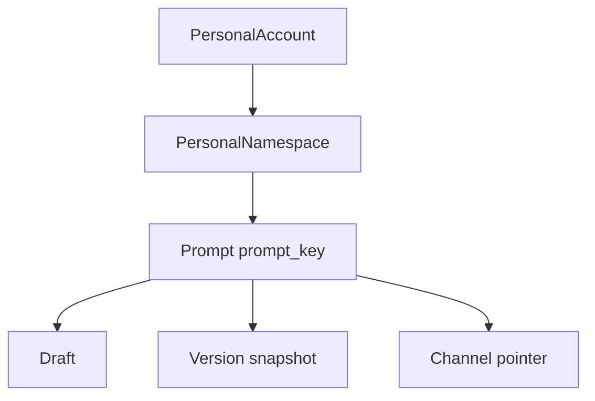

# 介墨（JieInkforge）Prompt — 专题 PRD

## 文档控制信息

| 项目       | 内容                                                                                                                        |
| -------- | ------------------------------------------------------------------------------------------------------------------------- |
| 文档版本     | v0.1                                                                                                                      |
| 文档状态     | Draft（主 PRD 拆章）                                                                                                             |
| 关联主 PRD  | [docs/inkforge.md](inkforge.md)                                                                                             |
| 任务拆解     | [plan/prompt-prd-tasks.md](../plan/prompt-prd-tasks.md)                                                                              |
| 关联专题     | [docs/prd-namespace.md](prd-namespace.md)（生命周期、配额、隔离、归档与 NS API）；[docs/prd-auth-console.md](prd-auth-console.md)（人机登录会话） |
| 读者对象     | 产品、后端/控制台研发、安全合规、售前与交付                                                                                                   |
| REQ-ID   | **PRM-001～010**（内容与 [inkforge §七](inkforge.md) 对齐）；本节展开与 **命名空间交集**所需 **NS-001 / NS-003 / NS-004** 切片                    |

**范围说明**：**当前版本实现范围**继承 [prd-namespace §1.1](prd-namespace.md)：仅 **个人账户 + 个人命名空间**；不向终端暴露租户切换。Prompt 业务能力以本文与主 PRD §七为准；**Console 会话与 NS 密钥细则**分别以 auth / namespace / 主 KEY 章节为准。

### REQ 映射（本专题直接使用）

| REQ-ID   | 摘要                                                     | 优先级                 |
| ------ | ------------------------------------------------------ | ------------------- |
| PRM-001 | Markdown/富文本正文；占位符 `{{param_name}}` 与 schema 对齐           | P0                  |
| PRM-002 | 标签与检索：全文、tag、负责人、时间过滤                                | P0                  |
| PRM-003 | 变量表：类型、描述、必填、默认值、校验（regex/range/enum）              | P0                  |
| PRM-004 | 保存时校验占位符与 schema；未声明或未使用变量可配置为错误/警告                  | P0                  |
| PRM-005 | 版本快照捆绑内容与 schema；变更说明、创建人、时间；Diff                 | P0                  |
| PRM-006 | 频道 production/staging/dev（可自定义）；回滚为指针指向旧版本            | P0                  |
| PRM-007 | 审批流：可选 MR 式审批后方可切 production                         | **P1**（本期占位，启用前单列决议） |
| PRM-008 | 导出 JSON/ZIP；导入灾备/克隆                                  | P1                  |
| PRM-009 | PII 风险提示占位                                             | P1                  |
| PRM-010 | 扩展：审计详情、breaking 标记、契约冻结、locale、评测备注等（见 §6）        | P0～P2              |
| NS-001  | 命名空间 **归档** 后禁止与本专题相关的写路径；恢复后恢复（细则见 [prd-namespace §4](prd-namespace.md)） | P0（切片）              |
| NS-003  | **硬性隔离**：Prompt、版本、频道指针在 **账户隔离域 + NS** 内查询与写入        | P0（切片）              |
| NS-004  | **Prompt 数量**、**版本保留** 等配额与耗尽体验（月 API 等见 namespace 专题）    | P0～P1（切片）          |

---

## 1. 范围与边界

| 范围内                                                                                                | 范围外                                                                     |
| -------------------------------------------------------------------------------------------------- | ----------------------------------------------------------------------- |
| **内容维护**：草稿、正文、结构化参数 schema、占位符一致性校验、标签与列表/检索                                                             | NS 生命周期 **专属**文案与 NS-only API（详见 [prd-namespace](prd-namespace.md)） |
| **版本维护**：不可变快照、变更说明、Diff、历史列表                                                                 | **Resolve API / Go SDK** 契约与错误语义全文（见 [inkforge §八](inkforge.md)）    |
| **发布**：频道维度的指针、回滚（不改变历史快照存在性）                                                                     | InkScribe 产品细则与配额（见 [inkforge §十](inkforge.md)；MVP+）                         |
| 与命名空间交集：**唯一性边界**、`ns_slug` 路径下的管理 API、`archived` 写拦截、**Prompt 配额**、**默认频道** 继承、控制台 **NS 上下文** 进入路径           | Prompt **调试台** UI/提供商/BYOK 全文（见 [inkforge §九](inkforge.md)）               |
| **RBAC**：当前控制台 **仅账号本人 ≈ NS 所有者** —— 等价于主 PRD 开发者/所有者合并体验；不写 NS-005 多成员矩阵                                        | NS-005 团队空间成员、邀请、只读成员 UI（**当前 Non-scope**，见 prd-namespace）             |

### 1.1 与主 PRD 信息架构（控制台）

与 [inkforge §信息架构](inkforge.md) 对齐的 **Prompt 详情建议 Tab**（可在实现期合并子路由）：

| Tab | 内容                                        |
| --- | ----------------------------------------- |
| 编辑  | 正文 + 参数 schema + 占位符校验（PRM-001～004）        |
| 版本  | 快照列表、Diff、变更说明（PRM-005）                  |
| 发布  | 频道指针、回滚（PRM-006）                        |
| 调试  | 试跑等（实现与需求细则见主 PRD §九，**数据源**为本专题草稿/已选版本） |
| 审计  | 与本 Prompt 相关的指针等事件摘要（与 PRM-010、NS 审计协同） |

**进入路径（个人 NS MVP）**：登录 → 选择或创建 **个人 NS**（[prd-namespace §4.3](prd-namespace.md)）→ **Prompt 列表** → 某 `prompt_key` 详情（上述 Tab）。全局或模块顶栏 **NS 上下文选择器** 要求见 prd-namespace §8。

---

## 2. 对象模型

与主 PRD §7.1、命名空间 §3.1 一致：

| 概念        | 说明                               |
| --------- | -------------------------------- |
| `prompt_key` | 与 **NS** 组合唯一；人类可读 slug，用于管理 API 路径与 Resolve 路径 |
| 草稿        | 未形成不可变版本前可编辑                     |
| 版本链表      | semver 或单调整数 + 可选 tag（**P-DEC**，见任务文档） |
| 发布指针      | 如某 `channel` → 某版本 id；Resolve 按 channel 解析 |

**关系（个人账户视角）**：

---

## 3. 内容维护（PRM-001～004）

| REQ-ID | 需求描述                                                                                         | 优先级 |
| ------ | -------------------------------------------------------------------------------------------- | --- |
| PRM-001 | 支持 Markdown/富文本正文；占位符 `{{param_name}}` 与参数 schema 名称对齐                                       | P0  |
| PRM-002 | 标签与检索：全文、tag、负责人、时间过滤；MVP 可裁剪为列表分页 + 基础过滤，完整检索二期补足                                       | P0  |
| PRM-003 | 变量表：类型、描述、必填、默认值、校验（regex/range/enum）                                                     | P0  |
| PRM-004 | **保存草稿**时校验正文占位符与 schema：未声明占位符、未使用变量等可配置为 **错误阻断** 或 **警告**（产品配置项，见 P-DEC）                  | P0  |

**默认频道**：新建 Prompt 或打开编辑页时，若未显式选择频道，控制台默认 `channel` 取自当前 NS 的 `default_channel_slug`（[prd-namespace §3.2](prd-namespace.md)）。**不改变** Resolve 必须显式传 `channel` 的运行时契约（主 PRD §八示例）。

### 验收摘要（内容）

| REQ-ID     | 验收标准                                                         |
| ---------- | ------------------------------------------------------------ |
| PRM-003～004 | Given schema 与正文占位符不一致 When 保存草稿 Then 按配置 **阻断** 或 **警告** |

---

## 4. 版本维护与发布（PRM-005～007）

| REQ-ID | 需求描述                                                          | 优先级 |
| ------ | ------------------------------------------------------------- | --- |
| PRM-005 | 从当前草稿 **固化**不可变版本快照：捆绑正文 + schema；记录变更说明、创建人、时间；支持两版本 **Diff** | P0  |
| PRM-006 | 频道（如 production / staging / dev，可自定义）；**回滚** = 指针改指旧版本，**不删除**历史快照    | P0  |
| PRM-007 | 切换 **production** 指针前可选 **审批/MR** 流                                      | P1  |

### 验收摘要（版本与发布）

| REQ-ID | 验收标准                                                                       |
| ------ | -------------------------------------------------------------------------- |
| PRM-005 | 版本创建后内容与 schema **不可变**                                                |
| PRM-006 | Resolve(`channel`) 返回该频道指针所指版本；回滚不改变历史快照 **存在性**                      |

**Resolve 引用**：HTTP 示例与鉴权方向见主 PRD **§八**（如 `GET /v1/ns/{slug}/prompts/{key}?channel=`）；本文仅要求管理侧写入的数据模型与指针语义满足上述验收。

---

## 5. 扩展能力（PRM-008～010 摘要）

| REQ-ID | 说明                          | 建议优先级 |
| ------ | --------------------------- | ----- |
| PRM-008 | 导出 JSON/ZIP；导入灾备/克隆        | P1    |
| PRM-009 | PII 风险提示占位                  | P1    |
| PRM-010 | 简短扩展集合，避免与主 PRD 全文重复抄写：       | —     |

**PRM-010 明细（摘录）**

1. **审计**：指针变更、密钥相关事件可与 NS 审计维度关联（字段含账户隔离域 id、`ns_slug`、`prompt_key`）。
2. **Breaking change**：schema 不兼容时控制台/SDK **告警**（策略可配）。
3. **契约冻结**：已发布版本仅可增加 **可选**参数（策略可配）。
4. **多语言**：同 key 下 locale 维度（zh-CN/en-US）。
5. **评测（P2）**：golden 样例手工备注。
6. **多模板片段（P1）**：system/user/tool 分栏；MVP 可先单框 + 角色类元数据。

---

## 6. 与命名空间硬性交集（详细约束）

以下在 [prd-namespace](prd-namespace.md) 中为 **顶层 REQ**，本文为 **Prompt 侧可执行语义**。

### 6.1 隔离（NS-003）

- **`prompt_key` 仅在同一 NS 内唯一**（同一账户隔离域下可跨 NS 重复不同 NS 内的 key）。
- **列表、搜索、读草稿、读写版本、读写频道指针** 的 repository 与 API 必须带 **`tenant_id`/账户隔离域 + `ns_id`（或由 `ns_slug` 绑定解析）**，禁止仅用 `prompt_key` 或版本 ID 跨 NS 访问。
- **版本 ID**不得被其它 NS 的 Prompt **引用或解析成功**。

### 6.2 归档 NS（NS-001 对 Prompt 的写矩阵）

命名空间 **`archived`** 时：

| 操作            | 行为                            |
| ------------- | ----------------------------- |
| 创建 Prompt / 保存草稿 | **拒绝**                        |
| 创建版本快照        | **拒绝**                        |
| 切换频道指针        | **拒绝**                        |

**读路径**：已存在草稿/版本列表是否在归档下只读展示，以及 **Resolve** 对已发布内容是否仍允许，由命名空间决议 **N-DEC-02** 统一收口（见 §8 与本专题不重复发明策略）。

### 6.3 配额（NS-004 与 Prompt 直接相关）

| 维度       | 行为方向                                               |
| -------- | -------------------------------------------------- |
| Prompt 数量 | 当前 NS 下 `prompt_key` 个数上限；**创建**新 key 超限拒绝；`code` 如 `NS_QUOTA_PROMPTS_EXCEEDED`（或统一 `QUOTA_EXCEEDED` + 细分） |
| 版本保留     | 每 Prompt 快照数或总存储近似；超限 **拒绝新建** 或 **异步清理**（与命名空间 / 平台任务共用决议，见 [plan/namespace-prd-tasks.md](../plan/namespace-prd-tasks.md) N-DEC 外补充） |

**封顶**：`min(平台/套餐或账户级策略, NS 本地配置)`（与 prd-namespace §6 一致）。

---

## 7. API / 契约方向（Console 管理 API，占位）

**契约源**：go-zero [services/console/console.api](../services/console/console.api) 扩展后 `goctl api go --style go_zero`（仓库规则）。**不向终端用户暴露内部 `tenant_id`**；与会话 **JWT** 隐含的账户隔离域对齐；路径与现有 NS 分组一致时建议前缀：

- 基路径示例：`/api/v1/me/namespaces/:nsSlug/prompts/...`（与现有 `GET /api/v1/me/namespaces` 并列）

**方向性能力**（最终实现以 OpenAPI/.api 为准）：

| 方法 / 路径（示意）                                      | 语义                 |
| ------------------------------------------------ | ------------------ |
| `GET/POST …/prompts`                             | 列表 / 创建 `prompt_key` |
| `GET/PATCH/DELETE …/prompts/:promptKey`          | 元数据、软删或禁用（若产品定）  |
| `GET/PUT …/prompts/:promptKey/draft`             | 读/写草稿              |
| `POST …/prompts/:promptKey/versions`             | 从草稿固化版本            |
| `GET …/prompts/:promptKey/versions`              | 版本列表               |
| `GET …/prompts/:promptKey/versions/:a/diff/:b`   | Diff（或 query 参数二选一） |
| `GET/PATCH …/prompts/:promptKey/channels/:channel` | 读/写频道指针            |

**错误码方向**（与主 PRD / apperr 对齐）：**404**（NS 或 key 不存在）、**403**（无权）、**409**（key 冲突、归档写拒绝等）、**429**（配额/限流）、稳定 **JSON `code`**。

---

## 8. 验收标准汇总

### 8.1 主 PRD PRM（摘录）

见 §3～4 验收表。

### 8.2 命名空间专题 AC（与 Prompt 相关）

| 编号        | 场景                                                                                    |
| --------- | ------------------------------------------------------------------------------------- |
| AC-N-01   | **Given** NS 已归档 **When** 创建版本或切换频道指针 **Then** 失败且错误码/文案明确（扩展：保存草稿、创建 key 同理，见 §6.2） |
| AC-N-04   | **Given** Prompt 配额已满 **When** 创建新 `prompt_key` **Then** 配额错误且列表不增加                      |
| NS-003 测 | 篡改路径中 `ns_slug` 为同账户下其它 NS 时，不得读取或写入本不属于该 NS 的 Prompt/版本/指针（**403** 或空结果，与契约一致）                |

---

## 9. 开放问题（Prompt 相关子集）

与命名空间 **N-DEC / N-OPEN** 交叉项在此跟踪；**单一事实来源**仍以 [prd-namespace §2、§12](prd-namespace.md) 为准。

| ID        | 问题                                        | 备注                          |
| --------- | ----------------------------------------- | --------------------------- |
| N-DEC-02  | 归档 NS 下 Resolve 与 **只读管理读**默认策略          | 影响线上观测与 Prompt「发布」页的只读体验      |
| N-OPEN-01 | 与上同源：归档后是否默认允许 Resolve                    | Prompt 读取侧依赖 NS 决议          |
| N-OPEN-03 | NS 级「谁可切 production 指针」是否独立策略               | 与 **PRM-007**、未来 NS-005 交叉   |

**Prompt 专题补充占位**（决议回填见 [plan/prompt-prd-tasks.md](../plan/prompt-prd-tasks.md)）：

| ID       | 议题                  |
| -------- | ------------------- |
| P-DEC-01 | 版本号形态：semver vs 单调序号 |
| P-DEC-02 | Diff 范围：正文 / schema / 二者 |
| P-DEC-03 | PRM-007 本期是否启用        |
| P-DEC-04 | PRM-004 严苛度默认：报错 vs 警告  |

---

## 10. 与 go-zero 的衔接（无代码）

与 [prd-namespace §13](prd-namespace.md) 一致：**中间件**建议顺序为 `auth` → **账户隔离域 / 会话上下文** → **NS 解析** → **配额** → **`archived` 写拦截**；Prompt 管理路由必须与 NS 守卫 **共用**同一 `ns_id` 作用域。错误包与全平台 **`apperr` / HTTP `code`** 对齐。

---

## 修订记录

| 版本   | 日期         | 摘要                                  |
| ---- | ---------- | ----------------------------------- |
| v0.1 | 2026-05-19 | 拆章：PRM + NS 切片 + Console IA/API 占位 |

