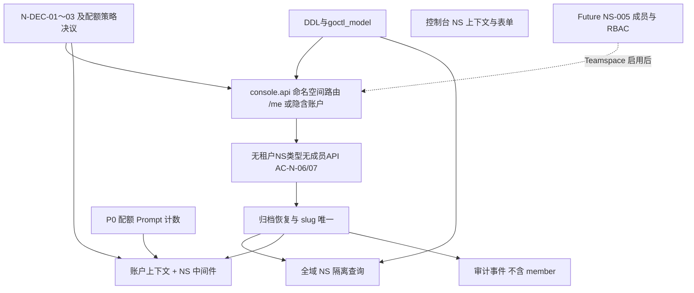

<!-- 与 Cursor 规划同步时可复制 frontmatter；本文件优先作为仓库内可编辑的执行清单 -->
<!--
name: Namespace PRD 任务拆解
overview: 基于 docs/prd-namespace.md v0.3，将 REQ NS-001～005 与各章节拆成可交付的工程任务；Prompt 工单见 plan/prompt-prd-tasks.md。区分当前个人账户 MVP 与未来 Teamspace。
-->

# 命名空间（Namespace）PRD → 可实现任务与优先级

**依据**：[docs/prd-namespace.md](../docs/prd-namespace.md) v0.3（与主 PRD NS-001～005 对齐；**当前实现范围以 PRD §1.1 为准**）。

**版本边界（PRD §1.1）**：**当前版本仅交付个人账户 + 个人命名空间**。不交付租户/团队命名空间创建、成员邀请、Team 权益与个人 NS → Teamspace。**NS-005 为 P1 / 未来版本，当前 Non-scope**。

**工程约束**：REST 契约以 `.api`/OpenAPI 为源，`goctl api go … --style go_zero`（见 `.cursor/rules`）；当前 [services/console/console.api](../services/console/console.api) 含 Auth 与 `/api/v1/me/namespaces`。命名空间在 **DDL → model（如适用）→ `.api` → logic** 上增量落地。实现上可用内部 `tenant_id`（如每人默认隔离域）；**控制台不向终端用户暴露「租户管理员」「租户切换」**（PRD §1.1 实现说明）。

**Prompt 工单**：**Prompt / 版本 / 频道指针** 的 DDL、API、logic、前端与专项测试见 **[plan/prompt-prd-tasks.md](prompt-prd-tasks.md)**；本文保留 **NS 横切**（中间件、归档写拦截底座、Prompt **数量**配额合并、跨 NS 守卫）与 Resolve 密钥断言。

---

## 实施前必须先定的决议（否则会返工）

| ID | 内容 | 对实现的影响 |
|----|------|----------------|
| N-DEC-01 | 是否增加 `pending` 等中间态 | 状态字段、创建工作流是否需要异步回调 |
| N-DEC-02 | **archived** 下 Resolve 默认只读 / 全拒 / 可配置 | 中间件与错误码分支、策略存储 |
| N-DEC-03 | `ns_slug` 字符集与长度 | DB 约束、校验、409 文案 |
| N-DEC-04 | MVP 归档 + 恢复；硬删除不接 | 仅实现 `active` / `archived` 即可 |
| N-DEC-05 | 是否允许 NS 跨租户迁移 | 默认 Non-goal；若要做须单独 RFC |
| N-DEC-06 | 环境建模主路径 | **多 NS + 密钥隔离** vs 单 NS + `env` 标签（影响引导与文档） |

---

## P0 — 必须与 NS-001 / NS-002 / NS-003 核心对齐（当前个人账户 MVP）

### 数据与仓储

1. **`namespaces` 表与索引**：**账户隔离域内** **`ns_slug` 唯一**（NS-002；当前版本即**同一个人账户**下唯一；可与内部默认 `tenant_id` 对齐）；字段含展示名、描述、标签 JSON/关联表、`status`（`active` \| `archived`）、可选默认频道、所有者/元数据占位；归档时间戳等（支撑 NS-001）。
2. **`goctl model`**：由 DDL 生成 model；业务扩展放 logic / `internal/pkg`（仓库规则）。

### Namespace 管理 API（契约优先）

3. **`console.api` 扩展**：按 PRD §10 **当前版本推荐路径**定义列表/创建（如 `GET/POST /me/namespaces` 或会话隐含账户下的 `GET/POST /namespaces`）、单 NS `GET/PATCH`、归档/恢复；JWT 保护与现有 `console.api` auth 分组对齐；409（slug 冲突）、404（NS 不存在）、403（无权）、归档后写路径 409/403 等与主 PRD 错误码方向对齐。**不向终端用户暴露 `tenant_id`**（若路由设计需要内部 tenant，放在解析层）。
4. **`goctl api go`**：再生 handler/routes/logic/types，在 **logic** 实现创建（唯一性校验）、归档、恢复（NS-001）。
5. **归档后的写拦截**（验收 NS-001、AC-N-01）：对已归档 NS，拒绝 **Prompt 相关写路径**（创建 key、草稿、版本、指针）——实现为 **共用 guard**（middleware 或 pkg）供 Prompt 路由挂载；**逐项 API 与 logic** 见 **[prompt-prd-tasks.md](prompt-prd-tasks.md)（`p0-prompt-guards`）**。

### 硬性隔离 NS-003

6. **repository 查询带 NS 作用域**：**密钥绑定、配额计数** 及 **Prompt/版本/指针/调试** 的实现体（表在 Prompt 工单 DDL）均须按 **`tenant_id`（内部）+ `ns_id`**（或 `ns_slug`→id）访问；禁止仅靠 `prompt_key`/版本 ID 跨 NS。**Prompt 表的 goctl model 与 DAO 调用点** 由 **prompt-prd-tasks** 落地；本线负责 **中间件注入 `ns_id`** 与评审串数据风险。
7. **自动化测试**（PRD §5.3）：错误 `ns_id` 为空集或 403；篡改路径 `ns_slug` 为**同一账户隔离域内**其它 NS 时行为符合契约。含 **Prompt 链路的契约测试** 可与 **Prompt 工单 `p0-prompt-tests`** 分工（见 **prompt-prd-tasks**「测试与验收分工」）。

### Resolve / 密钥越权（与 AC-N-03 一致）

8. **凭据解析**：NS 密钥仅能访问其绑定 NS（与现有/规划 KEY scope 协同）；在 Resolve 或服务边界加 **断言**（实现位置依主 PRD 服务拆分而定）。

### 范围守卫（PRD AC-N-06 / AC-N-07、§7.1、§8）

9. **能力与入口收敛**：控制台与 API **不提供**「租户 / 团队命名空间」类型选项；**不提供**成员邀请、共享编辑、`…/members` 等 NS-005 API（若占位路由存在须拒绝或不存在）；验收：**无**无效「邀请成员」空按钮——可用设置页 **文案**说明协作与团队空间在 **Team 计划中提供**（PRD §7.1，具体文案品牌协同）。

---

## P0～P1 — NS-004 配额（按维度分期）

### P0（建议首期）

10. **Prompt 数量配额**：计数按 NS（PRD §6）；满额时 **创建 `prompt_key`** 拒绝，`NS_QUOTA_PROMPTS_EXCEEDED`（或统一 `QUOTA_EXCEEDED` + 细分 code）；封顶 **`min(平台/套餐或账户级策略, NS 本地配置)`**（AC-N-04）。**Console 创建入口** 实现在 **Prompt 工单**（与计数 hook 对齐）。
11. **配额配置存储与读取**：NS 侧配置结构 + 与账户默认值/上限合并逻辑。

### P0～P1（紧随或二期）

12. **版本保留策略**：超限拒绝或异步清理——需产品与研发在 N-DEC 外再定「拒绝 vs 清理」；与 **Prompt 工单 `p1-prompt-quota-versions`**、**P-DEC-05** 同一口径。
13. **月 API 计量**：Resolve（及可选管理读）按月计量；耗尽 429/403 + `Retry-After` 或账单月说明（可与限流 middleware 对齐）。

### P1 / MVP+（与 NS-004 表一致，按排期）

14. **并发调试**配额：排队或拒绝 + 明确文案（PRD §6）。
15. **InkScribe**：token/请求按 `usage_type=inkscribe` 独立计数（MVP+；耗尽策略可与月 API 合并或分列）。
16. **审计保留天数**：NS 级或继承上级策略（运维配置；PRD §6）。

---

## Future — NS-005（团队空间 Teamspace / 租户主账号；当前 Non-scope）

以下任务**不在当前个人账户 MVP 交付范围内**；与 PRD §7.2、§9 `ns.member.*`、§10 成员路由对齐，待 Team / 租户主账号启用后立项。

17. **`namespace_members`**（或与主 PRD RBAC 表统一设计）：绑定用户/组、`ns_slug`/`ns_id`、角色枚举（NS 所有者/开发者/只读等）；与租户默认角色模板（PRD §7.2）。
18. **API**：`GET/POST/PATCH/DELETE …/namespaces/{ns_slug}/members`（及 future `…/tenants/{tenant_id}/namespaces` 等管理场景）。
19. **权限矩阵执行**：控制台与 API 对归档、密钥、指针切换、调试台等与主 PRD §3.3 对齐（多主体生效后）。
20. **只读成员 UI**：隐藏或禁用写按钮（PRD §8；**当前版本不适用**）。
21. **审计**：`ns.member.added` / `removed` / `role_changed`（PRD §9；**当前版本不产生**）；验收参见 AC-N-05（Deferred）。

---

## 控制台与上下文（横跨 P0 / Future）

22. **P0**：全局或模块顶栏 **NS 上下文选择器**：**当前个人账户下的个人 NS 列表**（PRD §8）；切换后列表/详情仅展示该 NS；可参考 [web/console/src/stores/workspaceContext.ts](../web/console/src/stores/workspaceContext.ts) 扩展（措辞从「租户下 NS」改为「个人账户下 NS」）。
23. **P0**：创建 NS 表单——slug（前置唯一校验）、展示名、描述、标签、默认频道；**不得提供**租户/团队命名空间类型（PRD §8）。
24. **P0**：归档/恢复 **强确认** 文案；**当前版本**仅 **NS 所有者（账号本人）** 可执行（PRD §8、§4.2）；未来 Teamspace 再扩展租户管理员等。
25. **P1（非 NS-005）**：多 NS 模式下创建流程 **slug 范式提示**（如 `acme-staging`）（PRD §8）。

---

## 审计与可观测（PRD §9）

26. **`ns.created`** / **`ns.archived`** / **`ns.restored`** / **`ns.settings.updated`**（**P0**：建议与生命周期同步上线）。
27. **可选** **`ns.quota.hit`** 或通用 **`quota.exceeded`**（按平台统一枚举）。
28. **`ns.member.*`** → 见 **Future §NS-005**，当前不实现。
29. 日志/trace 维度统一 **账户隔离域 id**（内部可与 `tenant_id` 等价）、**`ns_slug`** 或 **`ns_id`**（与现有结构化日志对齐）。

---

## 中间件与错误包（PRD §13）

30. **P0**：**个人账户 / 会话上下文**解析为单一隔离域 → 加载 NS → **archived 写拦截**（顺序示例：`auth` → **账户上下文 / 内部 tenant** → `ns` → `quota` / `archive_write`）；不显式暴露多租户控制台概念。
31. 与全平台 **`apperr` / HTTP code**（如现有 [apperr](../services/console/internal/pkg/apperr/)）对齐稳定 **`code`**，便于 SDK。

---

## 依赖关系简述

---

## 优先级总表（执行任务清单）

| 优先级 | 任务编号（上文） | 对应 REQ / 说明 |
|--------|------------------|-----------------|
| **P0** | 1–9, 10–11, 22–24, 26–27, 29–31 | NS-001, NS-002, NS-003；NS-004（Prompt 配额 + 配置）；**范围守卫**（AC-N-06/07）；控制台 MVP；审计（不含 member）；中间件与错误码 |
| **P0～P1** | 12–13 | NS-004（版本保留、月 API） |
| **P1 / MVP+** | 14–16, 25 | NS-004（并发调试、InkScribe、审计保留、slug 范式提示） |
| **Future（当前 Non-scope）** | 17–21, 28 | **NS-005**；`ns.member.*` 审计；只读成员 UI；AC-N-05 |

**说明**：PRD 将 NS-005 标为 **P1 未来版本**且 **当前 Non-scope**；任务表中的 **P1** 行仅指 NS-004 延伸与控制台非协作类体验，**不包含**成员/RBAC，直至 Teamspace 路线图启动。

---

## 执行 TODO（可复制到工单）

| ID | 内容 | 状态 |
|----|------|------|
| decisions-blocking | 产品回填 N-DEC-01～03（及版本保留拒绝/清理口径），解锁状态机与 archived 读策略 | pending |
| p0-schema-api | DDL + goctl model；扩展 console.api（`/me/namespaces` 或等价）并 goctl 生成；实现 NS CRUD + archive/restore | pending |
| p0-scope-no-team-ns | API + 控制台：**无**租户/团队 NS 类型；**无**成员邀请入口与 members API（AC-N-06、AC-N-07）；设置页可选 Team 协作说明文案 | pending |
| p0-isolation-tests | 全域 repository/API 账户隔离域 + NS 作用域；跨 NS 自动化测试（Prompt 路径见 [prompt-prd-tasks](prompt-prd-tasks.md) 分工） | pending |
| p0-quota-mw | Prompt **数量**配额按 NS；中间件链路（账户上下文→NS→配额→归档写拦截）；稳定错误码（**满额创建 key** 的 4xx 以 Prompt Create logic 为准） | pending |
| p0-console-ui | NS 选择器（个人账户下 NS 列表）、创建表单、归档确认（仅本人） | pending |
| p0-audit | `ns.created` / `archived` / `restored` / `settings.updated`；可选 `quota` 触顶 | pending |
| p1-advanced-quota | 版本保留、月 API、并发调试、InkScribe、审计保留天数等（按产品排期） | pending |
| p1-console-env-hints | 多 NS 下 slug 范式引导（非 RBAC） | pending |
| future-ns005-teamspace | NS 成员表与 API、默认角色模板、权限矩阵、`ns.member.*` 审计（Teamspace / 租户主账号启用后） | deferred |
