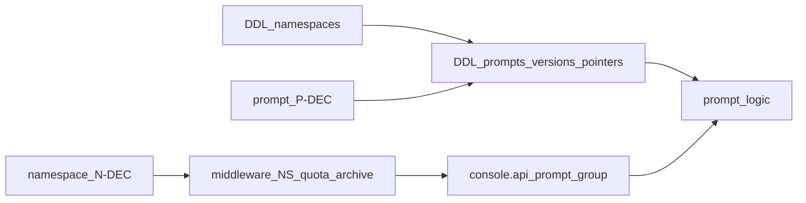

<!--
name: Prompt PRD 任务拆解
overview: 基于 docs/prd-prompt.md v0.1，将 PRM-001～006（及分期项）拆成可交付任务；与命名空间中间件/配额/归档守卫对接，不重复实现 NS 本体。
-->

# Prompt 专题 PRD → 可实现任务与优先级

**依据**：[docs/prd-prompt.md](../docs/prd-prompt.md) v0.1（与主 PRD [docs/inkforge.md](../docs/inkforge.md) §七 PRM 对齐）。

**版本边界**：与 [docs/prd-namespace.md](../docs/prd-namespace.md) **§1.1** 一致——**当前仅个人账户 + 个人 NS**；不向终端暴露 `tenant_id`； NS-005 / PRM-007（若未启用）不产生多主体权限分支。

**工程约束**：REST 契约以 `.api`/OpenAPI 为源，**`goctl api go … --style go_zero`**（见 `.cursor/rules`）；在现有 [services/console/console.api](../services/console/console.api)（`/api/v1/me/namespaces`）上 **增量** Prompt 路由分组；**DDL → goctl model（如适用）→ `.api` → logic**，业务放 `internal/logic` / `internal/pkg`。

**依赖命名空间任务**：中间件顺序、`archived` **写**拦截、账户隔离域 + `ns_slug` → `ns_id` 解析、Prompt **数量**配额与合并封顶——见 [plan/namespace-prd-tasks.md](namespace-prd-tasks.md)（条目 5、6、10～11、22、30～31 及工单 `p0-quota-mw`、`p0-isolation-tests`）。Prompt 工单负责 **Prompt/版本/指针** 路由与 repository 的 **NS 作用域实现**；NS 工单负责 **NS 资源** 与 **横切守卫底座**（若已拆分为共享 `internal/pkg`，则两线共用包）。

---

## 实施前必须先定的决议（Prompt 专属，否则会返工）

| ID | 内容 | 对实现的影响 |
|----|------|----------------|
| P-DEC-01 | 版本号形态：**semver** vs **单调整数** + 可选 tag | `prompt_versions` 表、排序、API 暴露 |
| P-DEC-02 | **Diff** 范围：正文 / schema / **二者**；是否含元数据 | Diff API、UI |
| P-DEC-03 | **PRM-007**（production 切换审批）**本期是否启用** | 若否：发布 Tab 仅直接 PATCH 指针；若是：加状态机/审批表 |
| P-DEC-04 | **PRM-004** 默认：**未使用变量/占位符不一致** → **硬错误** vs **警告** | 校验中间件或 logic、HTTP 4xx 策略 |
| P-DEC-05 | 版本保留 **超限**：**拒绝新建** vs **异步清理**（与 namespace 任务 12 共用一口径） | 写版本 API、后台任务 |

**交叉**：**N-DEC-02**（归档 NS 下 Resolve/只读）影响「发布/read-only UI」——决议仍归 [prd-namespace §2](../docs/prd-namespace.md)；Prompt 任务在 logic 层 **消费**该策略。

---

## P0 — 内容维护 PRM-001～004 + 骨架 API

### 数据与仓储

1. **DDL：`prompts`（或等价）**：在 **`tenant_id`/账户隔离域 + `ns_id`** 下 **`prompt_key` 唯一**；元数据字段满足 PRM-002（标签、负责人等 MVP 最小集）；与 `namespaces.id` 外键。
2. **DDL：`prompt_drafts`**（或与 `prompts`  blob 列二选一）：存当前可编辑正文 + JSON schema；**仅存「当前草稿」** 或版本化草稿由 P-DEC 定；默认建议单表草稿列降低 MVP 复杂度。
3. **`goctl model`**：由 DDL 生成；复杂 JSON 校验放 logic / pkg。

### Console 契约与生成

4. **`console.api` 扩展**（JWT + 与现有 `TenantCtx` 对齐）：在 **`/api/v1/me/namespaces/:nsSlug`** 下增加 `prompts` 分组，例如：`GET/POST …/prompts`、`GET/PATCH/DELETE …/prompts/:promptKey`、`GET/PUT …/prompts/:promptKey/draft`（路径以最终实现为准；须与 PRD §7 方向一致）。
5. **`goctl api go`**：生成 handler/logic/types；**logic** 内：创建 key（**409** 冲突）、读/写草稿、**归档 NS 写拒绝**（依赖共享 guard 或调用 NS status）、**Prompt 配额满拒绝**（与 namespace 配额计数 hook 对齐，**AC-N-04**）。

### 校验与搜索（MVP）

6. **占位符 ↔ schema 校验**（PRM-004）：保存草稿时执行；行为由 **P-DEC-04** 定。
7. **列表分页 + 基础过滤**（PRM-002 裁剪）：tag/负责人/时间可先做最小查询参数；全文检索可 P1。

---

## P0 — 版本维护 PRM-005 + 发布 PRM-006

8. **DDL：`prompt_versions`**：不可变快照（正文 + schema JSON + 版本号 + 创建者 + 时间 + 变更说明）；**外键**到 `prompts`，所有查询带 `ns_id`。
9. **固化版本 API**：`POST …/prompts/:promptKey/versions`（从当前草稿生成）；**archived NS 拒绝**（AC-N-01 扩展）。
10. **版本列表 API**：`GET …/prompts/:promptKey/versions`（分页）。
11. **Diff API**：`GET …/versions/:va/diff/:vb`（或 query）；实现依赖 **P-DEC-02**。
12. **DDL：`prompt_channel_pointers`**（或与 JSON 映射列）：`(prompt_id, channel_slug) → version_id` 唯一；`channel_slug` 与 NS 默认频道兼容。
13. **指针读写 API**：`GET/PATCH …/prompts/:promptKey/channels/:channel`；**归档 NS 下 PATCH 拒绝**（NS-001）；回滚语义 = 改指针（PRM-006）。

### PRM-007（可选 P0）

14. **若 P-DEC-03 = 启用**：增加审批实体与状态机，`PATCH production` 前检查；否则 **本条跳过**。

---

## P0～P1 — 配额交接（与 NS-004）

15. **版本保留**：在创建版本 logic 内检查每 Prompt（或 NS）快照计数；超限按 **P-DEC-05**；错误码与 `apperr` 统一。
16. **月 API / 管理读计量**：若 Resolve 独立服务，本 console 任务可仅 **透传配额头**或 **不接**；与 [namespace-prd-tasks](namespace-prd-tasks.md) 任务 13 **对齐排期**。

---

## P1 — PRM-008～010 与体验

17. **导出/导入**（PRM-008）、**PII 提示**（PRM-009）、**PRM-010** 子项（breaking 告警、契约冻结、locale）：按产品排期拆单（表设计可提前预留 JSON 扩展位）。
18. **控制台**：Prompt 列表页、详情 **Tab**（编辑/版本/发布/调试入口/审计摘要占位）；**NS 切换**依赖 [web/console/src/stores/workspaceContext.ts](../web/console/src/stores/workspaceContext.ts) 与 namespace 任务 22。

---

## 测试与验收分工

| 场景 | 主要责任工单 |
|------|----------------|
| 错误/伪造 `ns_id`、repository 串数据 | `p0-isolation-tests`（NS）+ Prompt 仓库单测 |
| 篡改 URL `ns_slug` 为**同账户**另一 NS | 契约测试可在 **任一侧** 跑全链路；建议 **Prompt API** 集成测覆盖 |
| 归档后写草稿/版本/指针 | Prompt logic + 共用 `archive` guard |
| Prompt 配额满创建 key | `p0-quota-mw`（计数 accurate） + Prompt Create logic **AC-N-04** |

---

## 审计与可观测（建议）

19. **`prompt.created`** / **`prompt.updated`**（草稿保存可合并或节流） / **`prompt.deleted`**（若开放）。
20. **`prompt.version.created`**；**`prompt.pointer.changed`**（含 `channel`、旧→新版本 id）。
21. 结构化日志/trace 字段与 NS 对齐：**账户隔离域 id**、`ns_slug`、`prompt_key`、`version_id`。

（与 **`ns.settings.updated`**、`ns.quota.*` 区分边界；不写 `ns.member.*`。）

---

## 依赖关系简述

---

## 优先级总表

| 优先级 | 内容 | REQ |
|--------|------|-----|
| **P0** | 条目 1～13（含 PRM-001～006 主路径）；与 NMW guard 接通；条目 18 控制台 MVP 与编辑器/版本/发布 Tab | PRM-001～006 |
| **P0**（条件） | 条目 14（仅当 P-DEC-03 启用） | PRM-007 |
| **P0～P1** | 条目 15～16 | NS-004 切片 |
| **P1+** | 条目 17；PRM-008～010 按子项拆分 | PRM-008～010 |

### Resolve / SDK

**不在本清单展开实现**；运行时契约见主 PRD **§八**。若 Resolve 与同 repo 共存，须在对应服务中 **断言** NS 密钥与 `ns_slug` 绑定（**AC-N-03**，namespace 任务 8）。

---

## 执行 TODO（可复制到工单）

| ID | 内容 | 状态 |
|----|------|------|
| prompt-decisions | 回填 **P-DEC-01～05**（及与 N-DEC-02 联动的只读 UI） | pending |
| p0-prompt-schema | Prompt/草稿/版本/指针 **DDL** + goctl model | pending |
| p0-prompt-api | 扩展 `console.api` Prompt 路由 + goctl 生成 + logic（CRUD key、draft、version、diff、pointers） | pending |
| p0-prompt-guards | 挂接 **archived 写拦截**、**ns_id 作用域**、**Prompt 配额**（与 namespace 中间件/计数一致） | pending |
| p0-prompt-tests | 隔离、归档写、AC-N-04、PRM 验收用例 | pending |
| p0-prompt-audit | `prompt.*` / `prompt.version.*` / `prompt.pointer.*` 事件与日志字段 | pending |
| p1-prompt-quota-versions | 版本保留策略实现（共用 P-DEC-05） | pending |
| p1-prompt-advanced | 导出导入、PRM-010 子项、全文检索（按排期） | pending |
| p1-prompt-approval | PRM-007 审批流（依赖 P-DEC-03） | pending |

